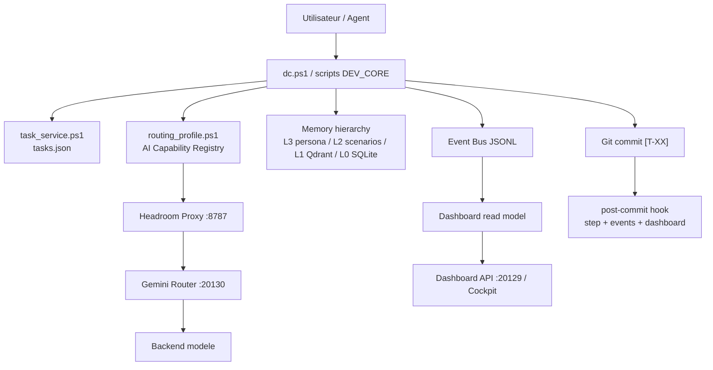

# DEV_CORE System Overview

Vue systeme consolidee de DEV_CORE v10.0. Cette page est l'entree rapide pour comprendre les sous-systemes, leurs sources de verite, les flux runtime et les tests de non-regression.

Voir aussi :

- `IMPLEMENTATION_HISTORY.md` pour la chronologie des implementations.
- `ARCHITECTURE_DECISIONS.md` pour les decisions structurantes.
- `AI_CAPABILITY_REGISTRY.md` pour le routage modele/agent declaratif.
- `PLATFORM_DOCUMENTATION.md` pour la documentation historique detaillee.
- `OPERATOR_GUIDE.md` pour l'exploitation quotidienne.
- `API_REFERENCE.md` pour les contrats HTTP.

## 1. Objectif

DEV_CORE est une plateforme locale d'orchestration IA pour developpement logiciel. Elle relie :

- un cycle de taches versionne (`tasks.json`, tags `[T-XX]`, hooks Git);
- une memoire persistante multi-couches (`Memory`, Qdrant, Obsidian, SQLite fallback);
- un cockpit local (`Dashboard`, `dashboard_api.py`);
- des services de routage et compression (`Headroom Proxy`, `Gemini Router`, `AI Capability Registry`);
- des contrats backend/API/DB testes en CI locale;
- un systeme de plugins, skills et templates.

Le systeme reste "single client" : un client actif execute le travail, tandis que DEV_CORE fournit contexte, routage, memoire, instrumentation et gates.

## 2. Carte des composants

| Sous-systeme | Role | Source de verite | Runtime | Tests |
|---|---|---|---|---|
| Task lifecycle | Creer, selectionner, avancer, terminer les taches | `DEV_CORE_DATA\Memory\<project>\tasks.json` | `task_service.ps1`, `task_next.ps1`, hooks Git | `test_task_service.ps1`, `test_task_list_adapter.ps1` |
| Routage IA | Choisir mode/profil/candidat modele | `Config\routing_profiles.json`, `Config\ai_capability_registry.json` | `routing_profile.ps1`, `gemini_router.py` | `test_routing_profile.ps1`, `test_ai_capability_registry.py` |
| Compression/offload | Reduire contexte et logs volumineux | `Config\headroom_config.yaml`, canvas runtime | Headroom Proxy `8787`, `canvas_manager.ps1` | contrats indirects via docs/scripts |
| Memoire | Lire/reutiliser decisions, lessons, patterns | `DEV_CORE_DATA\Memory`, Qdrant, Obsidian | `memory_service.ps1`, `memory_hierarchy.ps1`, `qdrant_sync.ps1` | `test_memory_service.ps1`, `test_qdrant_vector_contract.ps1` |
| Dashboard/cockpit | Vue projet, services, tasks, tokens, plugins | `Dashboard\template.html`, `DEV_CORE_DATA\Dashboard` | `gen_dashboard.ps1`, `dashboard_api.py` | `test_dashboard_api.py`, contrats cockpit/security |
| Event bus/read model | Journaliser evenements et snapshots dashboard | `DEV_CORE_DATA\Bus`, `Dashboard\read_model.json` | `event_bus.ps1`, `dashboard_read_model.ps1` | `test_event_bus.ps1`, `test_dashboard_read_model.ps1` |
| API v1 | Exposer contrats et integrations externes | `API\devcore_api`, `Schemas\openapi-v1.json` | FastAPI `run_api.py` | `API\test_*.py` |
| Database | Contrats SQL, repositories, outbox, audit | `Database\postgres_schema_v1.sql`, Alembic | `Database\devcore_db` | `Database\test_*.py` |
| Plugins | Capabilities internes extensibles | `Plugins\manifest_v2.schema.json` | `plugin_service.ps1` | `test_plugin_service.ps1`, `Plugins\test_manifest_v2_contract.py` |
| Skills | Methodologies et outils reutilisables | `Skills\*\SKILL.md`, `skills_registry.json` | `adapt_client.ps1`, skill loader client | `test_skill_agent_spec.ps1`, `skill_lint.ps1` |
| Repowise | Indexation documentation/code continue | `Config\projects.json`, `.mcp.json` | `ensure_repowise_*`, watchers | `test_repowise_*.ps1` |
| Verification | Gates locaux bornes | scripts CI | `verify.ps1`, `ci_*_tests.ps1` | tous les tests listes |

## 3. Flux principal



## 4. Cycle de tache

1. `dc next task` lit le board projet actif.
2. `routing_profile.ps1` resout `mode`, budget, profil DEV_CORE et candidat IA.
3. L'agent execute le travail dans le scope.
4. Les tests ciblés passent.
5. Commit avec tag `[T-XX]`.
6. Le hook post-commit incremente `steps_done`, publie un evenement et regenere le dashboard.
7. Si la tache est terminee, `task_done.ps1 -Force` chaine la suivante.

Quand aucune tache n'est active, le travail peut etre committe avec une tache creee explicitement via `dc new task`, ou avec un tag existant si la tache a ete detectee.

## 5. Routage et candidats IA

Le routage est maintenant en deux couches :

- `routing_profiles.json` garde le contrat historique `reasoning`, `coding`, `bulk`.
- `ai_capability_registry.json` decrit les candidats utilisables : langages, specialites, cout, vitesse, qualite, contexte maximal, backend.

Le runtime peut choisir un meilleur candidat par etape de workflow si la requete declare :

```json
{
  "mode": "coding",
  "capability_requirements": {
    "languages": ["javascript"],
    "specialties": ["tests"],
    "optimize_for": "speed"
  }
}
```

Le workflow ne depend donc pas d'un nom de modele specifique. Changer de modele ou ajouter un agent se fait dans le registry.

## 6. API et contrats domaine

Le gateway FastAPI v1 expose :

- `GET /api/v1/health`
- `GET /api/v1/contracts`
- `GET /api/v1/tasks`
- `POST /api/v1/integrations/github/webhook`

Les contrats domaine couvrent tasks, runs, events, plugins, workspaces, quotas, health. `export_openapi.py` genere `Schemas\openapi-v1.json` et le client TypeScript.

## 7. Donnees runtime

| Donnee | Emplacement | Regle |
|---|---|---|
| Tasks projet | `DEV_CORE_DATA\Memory\<project>\tasks.json` | source de verite taches |
| Logs scripts | `DEV_CORE_DATA\Logs\scripts` | diagnostic et session context |
| Dashboard payload | `DEV_CORE_DATA\Dashboard\dashboard_payload.json` | cache de lecture cockpit |
| Event bus | `DEV_CORE_DATA\Bus\events` | append-only events |
| Qdrant storage | `DEV_CORE_DATA\qdrant_storage` | collections vectorielles |
| Secrets | `DEV_CORE_DATA\Security` ou fichiers config secrets locaux | jamais dans docs ni commits |

## 8. Verification

Commandes rapides :

```powershell
python -m pytest DEV_CORE/Scripts/test_ai_capability_registry.py DEV_CORE/Scripts/test_gemini_router_routing_profile.py
powershell -ExecutionPolicy Bypass -NonInteractive -File DEV_CORE/Scripts/test_routing_profile.ps1
powershell -ExecutionPolicy Bypass -NonInteractive -File DEV_CORE/Scripts/verify.ps1 -CI
```

La CI locale est bornee par timeout pour eviter les blocages longs.

## 9. Limites connues

- Le router local cible principalement Gemini via backend OpenAI-compatible; les candidats non Gemini peuvent etre declares mais doivent rester `enabled=false` tant qu'un adapter direct n'existe pas.
- Le cockpit contient encore du HTML genere et du JavaScript inline; la migration React/Next existe mais n'a pas remplace toute la surface historique.
- La documentation historique `PLATFORM_DOCUMENTATION.md` est complete mais dense; les nouveaux fichiers `SYSTEM_OVERVIEW.md`, `IMPLEMENTATION_HISTORY.md` et `ARCHITECTURE_DECISIONS.md` doivent devenir les points d'entree.
- Les hooks Git Windows peuvent etre sensibles aux ACL et au shell disponible. Toujours verifier `git status --short --branch` apres commit.
