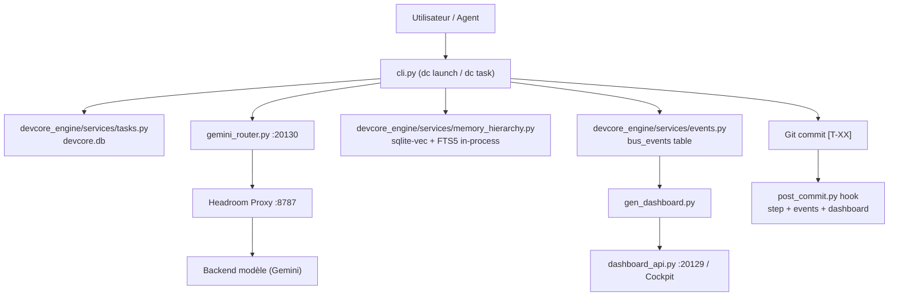

# DEV_CORE System Overview

Vue système consolidée de DEV_CORE v10.0. Cette page présente l'architecture unifiée basée sur Python natif (`devcore_engine`) et SQLite WAL (`devcore.db`), sans dépendance Docker.

Voir aussi :

- `IMPLEMENTATION_HISTORY.md` pour la chronologie des implémentations.
- `ARCHITECTURE_DECISIONS.md` pour les décisions structurantes.
- `AI_CAPABILITY_REGISTRY.md` pour le routage modèle/agent déclaratif.
- `PLATFORM_DOCUMENTATION.md` pour la documentation historique détaillée.
- `OPERATOR_GUIDE.md` pour l'exploitation quotidienne.
- `API_REFERENCE.md` pour les contrats HTTP.

## 1. Objectif

DEV_CORE est une plateforme locale d'orchestration IA pour le développement logiciel. Elle relie :

- un cycle de tâches versionné (SQLite `tasks`, tags `[T-XX]`, hooks Git Python natifs);
- une mémoire persistante multi-couches unifiée (`devcore.db`, in-process `sqlite-vec` 768d, SQLite FTS5);
- un cockpit local (`Dashboard`, `dashboard_api.py`);
- des services de routage et de compression (`Headroom Proxy`, `gemini_router.py`);
- des contrats et tests validés en CI locale;
- un système de plugins, skills et templates.

Le système reste "single client" : un client actif exécute le travail, tandis que DEV_CORE fournit contexte, routage, mémoire, instrumentation et gates.

## 2. Carte des composants

| Sous-système | Rôle | Source de vérité | Runtime | Tests |
|---|---|---|---|---|
| Task lifecycle | Créer, sélectionner, avancer, terminer les tâches | Table SQLite `tasks` | `devcore_engine/services/tasks.py`, hooks Git Python, `cli.py` | `test_devcore_engine.py` (pytest), `test_task_service.ps1` |
| Routage IA | Choisir mode/profil/candidat modèle | Table SQLite `config`, `routing_profiles.json` | `gemini_router.py` | `test_routing_profile.ps1`, `test_gemini_router_routing_profile.py` |
| Compression/offload | Réduire contexte et logs volumineux | Config YAML | Headroom Proxy `8787` | contrats indirects via docs/scripts |
| Mémoire | Lire/réutiliser décisions, leçons, patterns | Table SQLite `memory_entries`, `sqlite-vec` | `devcore_engine/services/memory_hierarchy.py` | `test_devcore_engine.py` (pytest) |
| Dashboard/cockpit | Vue projet, services, tasks, tokens, plugins | `Dashboard\template.html`, `Dashboard\index.html` | `gen_dashboard.py` (Python), `dashboard_api.py` | `test_dashboard_api.py` |
| Event bus / log | Journaliser événements et snapshots dashboard | Table SQLite `bus_events` | `devcore_engine/services/events.py` | `test_devcore_engine.py`, `test_event_bus.ps1` |
| Database | Contrats SQL, repositories, outbox, audit | Fichier unique `devcore.db` | `devcore_engine/db.py` | `test_devcore_engine.py` |
| Plugins | Capabilities internes extensibles | Table SQLite `plugins_registry` | `devcore_engine/services/plugins.py` | `test_devcore_engine.py`, `test_plugin_service.ps1` |
| Skills | Méthodologies et outils réutilisables | Table SQLite `skills_runtime` | `devcore_engine/services/skills.py` | `test_devcore_engine.py`, `test_skill_agent_spec.ps1` |
| Diagnostic | Gates locaux bornés | Moteur de diag natif | `devcore_engine/infra/diagnose.py` | `test_devcore_engine.py`, `test_diagnose_gate.ps1` |
| Vérification | Gates de non-régression | Scripts CI | `verify.ps1`, `ci_*_tests.ps1` | tous les tests listés |

## 3. Flux principal



## 4. Cycle de tâche

1. `dc task next` lit le board projet actif.
2. `gemini_router.py` résout `mode`, budget, profil DEV_CORE et candidat IA.
3. L'agent exécute le travail dans le scope.
4. Les tests ciblés passent.
5. Commit avec tag `[T-XX]`.
6. Le hook post-commit Python (`post_commit.py`) incrémente `steps_done`, publie un événement et régénère le dashboard.
7. Si la tâche est terminée, la suivante est activée.
8. En arrière-plan, le **Headroom Proxy** et le **Metrics Service** consignent les jetons dans les journaux de télémétrie SQLite.

## 5. Routage et candidats IA

Le routage est désormais géré via la configuration interne en base de données et `routing_profiles.json`. Le Gemini Router (`gemini_router.py` sur le port `20130`) sert de proxy de communication avec les API de modèles.

## 6. Données runtime (Vérité unique)

Toutes les données persistantes sont unifiées dans :
- **`DEV_CORE_DATA/devcore.db`** : Base de données unique SQLite WAL. Elle élimine les anciens conteneurs Docker (Postgres, Qdrant, Node) et les centaines de fichiers JSON/JSONL éparpillés.
- **Fichiers textuels autorisés** : Les clés API (`gemini_api_key.txt`) et les fichiers de contexte agent (`Config/AGENTS.md`, `CLAUDE.md`, `BOOT.md`) restent sur le système de fichiers pour des raisons de sécurité et de simplicité d'accès.

## 7. Vérification

Commandes rapides :

```powershell
# Exécuter les tests unitaires de l'engine Python unifié
python -m pytest c:\devcore\DEV_CORE\tests\test_devcore_engine.py

# Exécuter la suite d'intégration globale de non-régression
powershell -ExecutionPolicy Bypass -File c:\devcore\DEV_CORE\Scripts\verify.ps1
```

## 8. Limites connues

- La suite de tests PowerShell (`test_*.ps1`) est conservée temporairement pour la validation de non-régression et sera migrée en pytest dans les vagues futures.
- Les fichiers Git post-commit Windows peuvent être sensibles aux ACL locaux. Toujours vérifier `git status --short --branch` après commit.

