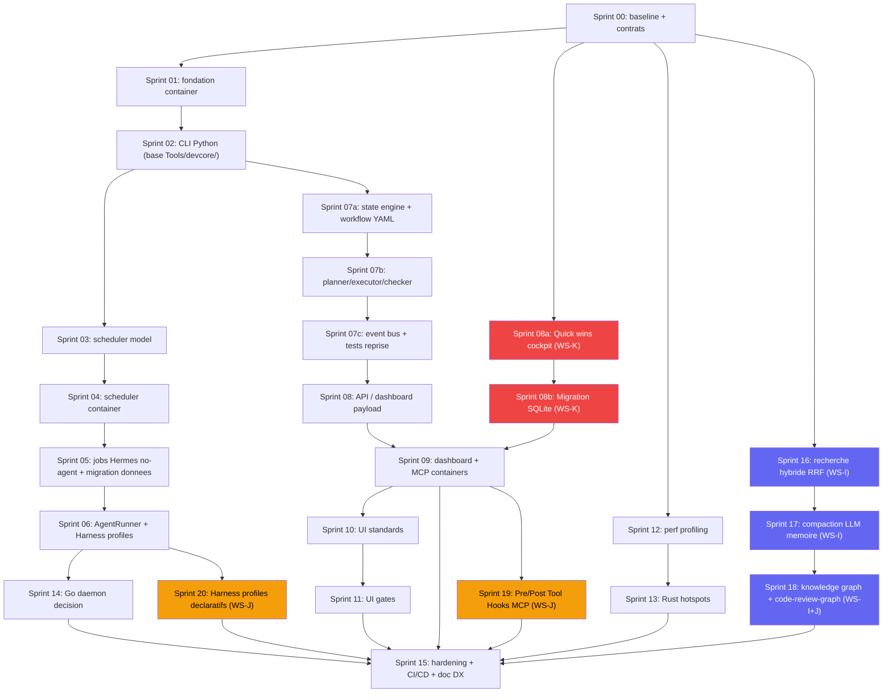

# DEV_CORE v10 -- Roadmap unifiee d'implementation

Date : 2026-07-17
Statut : draft de cadrage
Sources :
- `docs/DEV_CORE_HERMES_REPLACEMENT_PLAN.md`
- `docs/DEV_CORE_v10_Runtime_Orchestration_Plan.md`
- `docs/DEV_CORE_SKILLS_UI_CRAFT_PLAN.md`
- audit de conteneurisation integre depuis `docs/DEV_CORE_v10_CONTAINERIZATION_AUDIT.md`

## 1. Decision d'architecture

DEV_CORE v10 doit devenir container-first, sans migration globale vers Rust ou Go.

Repartition cible :

| Couche | Technologie cible | Role |
|---|---|---|
| Runtime, orchestration, workflows | Python | Cerveau du systeme : planner, executor, checker, scheduler, plugins |
| API externe | Python / FastAPI | Facade REST versionnee pour dashboard, integrations, webhooks |
| Services container | Docker Compose | Runtime reproductible : API, scheduler, workers, Qdrant, Postgres, dashboard |
| Outils performance | Rust | Scan, indexation, watcher, parsing, compression TOON, analyse logs |
| Daemon service optionnel | Go | Service long-running simple si Python ne suffit pas pour supervision reseau |
| Wrappers Windows | PowerShell | Bootstrap host optionnel uniquement |

Principes :

- Python reste le centre de gravite.
- Docker Compose devient le mode d'exploitation principal.
- PowerShell ne doit plus contenir de logique metier critique.
- Hermes devient un adapter optionnel, pas une dependance de runtime.
- Rust et Go ne sont introduits qu'apres mesure, derriere des contrats stables.
- Aucun conteneur ne doit demarrer Docker Desktop, manipuler Windows Scheduled Tasks ou piloter la session Windows.

## 2. Objectif unifie

Construire DEV_CORE v10 comme runtime d'orchestration portable, testable, observable et conteneurise, en :

- lancant les composants principaux via `docker compose up -d` ;
- remplacant progressivement Hermes par des composants DEV_CORE natifs ;
- deplacant la logique PowerShell vers Python ;
- gardant REST comme facade d'integration, sans forcer tous les appels internes en HTTP ;
- stabilisant Docker, volumes, healthchecks et variables d'environnement ;
- ajoutant des skills UI/motion utiles sans alourdir le runtime ;
- mesurant les performances avant toute extraction Rust ou Go.

## 3. Non-objectifs

- Pas de migration complete vers Rust ou Go.
- Pas de deuxieme runtime concurrent au runtime Python.
- Pas de reecriture massive des scripts sans tests.
- Pas de Knowledge Graph UI avant que les audits et gates statiques produisent des donnees utiles.
- Pas de Go daemon tant que les besoins de supervision long-running ne sont pas prouves.
- Pas de REST interne obligatoire entre modules Python du meme process.
- Pas de conteneur qui lance Docker Desktop du host.
- Pas de dependance critique a Windows Scheduled Tasks.
- Pas de `powershell.exe` appele par un service container pour une mutation metier.

## 4. Workstreams et priorites reajustees

| ID | Workstream | Priorite | Resultat attendu |
|---|---|---:|---|
| WS-A | Baseline, contrats, benchmark | P0 | Mesures fiables, contrats CLI/API/container, decisions tracees |
| WS-F | Conteneurisation core | P0 | Compose reproductible avec Qdrant, Postgres, API, router, volumes, healthchecks |
| WS-B | Migration PowerShell vers Python | P0 | `dc.py`, `launch.py`, `diagnose.py`, `tasks.py`, wrappers `.ps1` minces |
| WS-C | Scheduler natif et remplacement Hermes | P0 | Hermes hors chemin critique, scheduler DEV_CORE fiable en container |
| WS-D | Runtime d'orchestration | P1 | Planner, executor, checker, state engine, workflows YAML coherents |
| WS-E | REST/API et dashboard | P1 | API versionnee stable, dashboard plus leger, diagnostics natifs |
| WS-G | Skills/UI/Motion quality | P2 | Standards, audits, gates, plans auto-suffisants |
| WS-H | Performance Rust/Go | P2 | Hotspots extraits seulement si mesures le justifient |
| WS-I | Intelligence memoire (inspire marm-memory) | P1 | Recherche hybride RRF, compaction LLM, extension knowledge graph |
| WS-J | Agent harness et outillage (inspire OI, code-review-graph) | P1 | Harness profiles declaratifs, hooks MCP, AST Tree-sitter via code-review-graph |
| WS-K | Data architecture et migration SQLite | P0 | Elimination de l'architecture file-based (JSON 19 MB), migration etat vers SQLite, payload dashboard pagine, rotation logs |

Changement principal : Docker/Compose passe de P1 a P0. La conteneurisation n'est plus un sprint tardif de portabilite, mais une contrainte de fondation.

Changement 2026-07-19 : ajout WS-K (Data Architecture). L'audit du 19 juillet 2026 a revele que l'architecture file-based (104 fichiers JSON, payload dashboard 18.8 MB, token metrics 17.2 MB, 638 fichiers de logs accumules) est le bottleneck principal de DEV_CORE -- pas le langage. La migration vers SQLite et la pagination des payloads sont elevees en P0.

## 5. Audit de conteneurisation integre

### 5.1 Etat actuel observe

| Element | Etat actuel | Impact conteneurisation |
|---|---|---|
| Dockerfile / Compose | Aucun `Dockerfile` ou `docker-compose.yml` actif dans le repo | Base container a creer |
| Qdrant | Lance via `docker run qdrant/qdrant` dans `launch.ps1` | Deja compatible container, a migrer vers Compose |
| API v1 | FastAPI dans `DEV_CORE/API` | Facile a conteneuriser |
| Gemini Router | FastAPI/uvicorn, bind configurable mais loopback par defaut | Facile avec `0.0.0.0` en container |
| Dashboard API | Python HTTP server + appels `powershell.exe` | Conteneurisable apres retrait des mutations PowerShell |
| Web dashboard | Next.js dans `DEV_CORE/Web` | Facile a conteneuriser |
| Database | Postgres/Alembic present, URL par defaut `127.0.0.1` | Facile avec service `postgres` |
| MCP qdrant-storage | Python, Qdrant hardcode `localhost:6333` | Facile apres env `QDRANT_URL` |
| MCP devcore-scripts | Python mais execute `powershell.exe` | A remplacer par CLI Python |
| Scripts core | ~96 scripts `.ps1` detectes (117 si fichiers archives inclus) | Gros point de migration |
| Python core | ~160 fichiers `.py` detectes | Bonne base pour runtime container |
| CLI Python existant | 21 modules dans `Tools/devcore/` (cli, router, missions, memory, paths, session, telemetry) | Base solide pour Sprint 02 |
| Dashboard monolithe | `Dashboard/index.html` = 14.7 MB (fichier unique) | Migration Next.js a dimensionner |
| Hermes daemon | Scheduled Tasks, WMI/CIM, `LOCALAPPDATA`, `msvcrt` | Non portable tel quel |
| Repowise | Executable local sur `127.0.0.1` | Containeriser si binaire Linux disponible, sinon adapter `CodeSearchProvider` |

### 5.2 Architecture container cible

| Service | Image cible | Role | Volume |
|---|---|---|---|
| `runtime` | image Python DEV_CORE | orchestration, CLI, workflows | `devcore_data` |
| `api` | image Python DEV_CORE | FastAPI `/api/v1` | `devcore_data` |
| `scheduler` | image Python DEV_CORE | remplacement Hermes cron | `devcore_data` |
| `worker` | image Python DEV_CORE | jobs longs/asynchrones | `devcore_data` |
| `dashboard-api` | image Python DEV_CORE | backend cockpit et diagnostics | `devcore_data` |
| `dashboard-web` | image Node/Next ou Nginx statique | UI | cache build optionnel |
| `gemini-router` | image Python DEV_CORE | routage LLM/embeddings | secrets env |
| `headroom` | image dediee ou proxy compatible | compression/cache | cache volume |
| `qdrant` | `qdrant/qdrant` | memoire vectorielle | `qdrant_storage` |
| `postgres` | `postgres:16` | DB DEV_CORE | `postgres_data` |
| `mcp-qdrant` | image Python DEV_CORE | MCP Qdrant | aucun |
| `mcp-devcore` | image Python DEV_CORE | MCP DEV_CORE via CLI Python | `devcore_data` |

Principe d'image : une image Python DEV_CORE unique pour `runtime`, `api`, `scheduler`, `worker` et `mcp-*`, avec commandes d'entree differentes.

Principe de consolidation : fusionner les services Python a faible charge dans un meme conteneur si < 1 req/s et meme runtime. Candidats : `api` + `dashboard-api` + `scheduler` dans un seul process multi-worker (entry points distincts via uvicorn workers ou supervisord). Objectif : 8-9 services max en exploitation courante.

### 5.3 Matrice de conteneurisation

| Composant | Peut etre conteneurise ? | Action recommandee | Alternative meme performance si blocage |
|---|---:|---|---|
| Qdrant | Oui | Compose `qdrant/qdrant`, volume dedie | Qdrant Cloud si besoin externe |
| Postgres | Oui | Compose `postgres:16`, healthcheck, migrations Alembic | SQLite WAL pour mono-user local |
| FastAPI API v1 | Oui | Uvicorn `0.0.0.0:20131` | Gunicorn/Uvicorn workers si charge plus haute |
| Gemini Router | Oui | `DEVCORE_GEMINI_ROUTER_BIND=0.0.0.0` | Envoy/NGINX devant si TLS/rate limit |
| Dashboard Web | Oui | Next standalone ou export statique | Nginx statique + API backend |
| Dashboard API | Partiel | Retirer `powershell.exe`, appeler API/runtime Python | FastAPI dashboard backend |
| Event bus JSONL | Oui | Porter en Python avec lock cross-platform | Redis Streams, NATS JetStream, Postgres outbox |
| Scheduler Hermes | Non tel quel | Remplacer par scheduler Python container | APScheduler, Celery Beat, Dramatiq, Temporal, supercronic |
| Hermes daemon Windows | Non tel quel | Adapter optionnel hors chemin critique | Scheduler DEV_CORE natif + `AgentRunner` |
| Windows Scheduled Tasks | Non | Remplacer par scheduler container | `supercronic`, Kubernetes CronJob, APScheduler |
| Docker Desktop bootstrap | Non | Host lance Docker/Compose | Podman Compose ou k3d selon besoin |
| WMI/CIM process management | Non | Healthchecks/process supervisor container | s6-overlay, supervisord, Docker healthcheck |
| Notifications Windows | Non | Dashboard notifications, logs, webhooks | Webhook Slack/Teams optionnel |
| Repowise local executable | Incertain | Containeriser si binaire Linux/image disponible | Rust/Tantivy, ripgrep sidecar, Sourcegraph local, OpenGrok |
| Obsidian vault | Oui comme donnees | Bind mount `DEV_CORE_DATA/Vault` | Git-backed markdown vault |
| MCP qdrant-storage | Oui | Rendre `QDRANT_URL` configurable | Integrer au runtime si MCP inutile |
| MCP devcore-scripts | Partiel | Remplacer `powershell.exe` par CLI Python | Image PowerShell 7 temporaire |
| TOON CLI | Oui | Installer dans image Node ou extraire en Rust | `devcore-toon` Rust |
| Secret scan | Oui | Python/Rust worker | `gitleaks` container |
| Tests Playwright | Oui | Image Playwright separee | CI hors Compose si trop lourd |

### 5.4 Configuration container obligatoire

| Sujet | Actuel | Cible container |
|---|---|---|
| `DEVCORE_PLATFORM_ROOT` | `C:\devcore\DEV_CORE` | `/app/DEV_CORE` |
| `DEVCORE_DATA_ROOT` | `C:\devcore\DEV_CORE_DATA` | `/data` |
| Qdrant URL | `http://localhost:6333` | `http://qdrant:6333` |
| Postgres URL | `127.0.0.1:5432` | `postgres:5432` |
| Gemini router | `127.0.0.1:20130` | `http://gemini-router:20130` |
| Dashboard API bind | `127.0.0.1` | `0.0.0.0` dans container |
| API bind | `127.0.0.1` | `0.0.0.0` dans container |
| secrets | fichiers locaux possibles | env/secrets mounts |
| logs | `DEV_CORE_DATA\Logs` | `/data/Logs` |

Tous les services doivent parler par noms Compose, pas par `localhost`, sauf appels internes au meme conteneur.

## 6. Contrats techniques obligatoires

### 6.1 CLI Python

Chaque commande Python exposee par wrapper PowerShell doit respecter :

- sortie machine lisible en JSON pour les commandes automatisees ;
- sortie humaine concise pour l'usage interactif ;
- codes de sortie stables ;
- logs ecrits dans `DEV_CORE_DATA/Logs`, pas uniquement stdout ;
- tests unitaires pour parsing, erreurs et idempotence.

### 6.2 Contrats container

Chaque service container doit respecter :

- un `command` explicite ;
- variables d'environnement documentees ;
- aucun chemin Windows obligatoire ;
- readiness/healthcheck ;
- donnees persistantes dans volume ;
- logs stdout/stderr + `/data/Logs` si necessaire ;
- arret propre sur SIGTERM ;
- pas de mutation metier via `powershell.exe`.

### 6.3 Rust tools

Les outils Rust communiquent d'abord par process boundary :

- input : arguments CLI, fichier, stdin JSON/JSONL ;
- output : stdout JSON/JSONL ;
- erreurs : stderr humain + code de sortie ;
- pas d'acces direct non documente a l'etat runtime ;
- version exposee via `--version` et `--capabilities`.

Passer a gRPC/REST seulement si l'outil devient long-running.

### 6.4 Go services

Go est autorise uniquement si au moins un critere est vrai :

- besoin d'un daemon long-running autonome ;
- supervision de processus multi-plateforme ;
- service reseau a haute disponibilite ;
- Python montre une limite mesuree sur latence, memoire ou stabilite.

Sinon, rester en Python.

### 6.5 API REST

REST sert de facade externe :

- dashboard ;
- integrations ;
- webhooks ;
- diagnostics ;
- controle runtime a distance.

REST ne doit pas remplacer les appels Python internes quand les modules vivent dans le meme runtime.

## 7. Roadmap par sprints

Cadence recommandee : sprint court de 3 a 5 jours pour garder les livrables verifiables.

### Sprint 00 -- Baseline, audit executable et contrats

Priorite : P0
Objectif : figer l'etat initial, les contrats container et les mesures de reference.

Livrables :

- Inventaire des scripts PowerShell, modules Python, endpoints API, jobs Hermes et services container cibles.
- Matrice "garder / migrer / wrapper / supprimer / containeriser".
- Baseline `devcore benchmark` minimale.
- Baseline `devcore profile` sur `launch`, `dc next task`, dashboard generation, task scan.
- ADR "Container-first, Python core, Rust tools, Go optional daemon, PowerShell host wrappers".
- Spec Compose cible minimal.

Critere d'acceptation :

- Chaque futur sprint a une mesure de reference ou une raison explicite de ne pas en avoir.
- Les services P0 ont leurs variables, ports, volumes et healthchecks definis.

### Sprint 01 -- Fondation container P0

Priorite : P0
Objectif : obtenir une tranche verticale conteneurisee minimale.

Livrables :

- `DEV_CORE/docker/Dockerfile.python`.
- `.dockerignore`.
- `docker-compose.yml` minimal : `qdrant`, `postgres`, `api`, `gemini-router`.
- API FastAPI bindee sur `0.0.0.0` en container.
- Variables : `DEVCORE_PLATFORM_ROOT=/app/DEV_CORE`, `DEVCORE_DATA_ROOT=/data`, `QDRANT_URL=http://qdrant:6333`, `DEVCORE_DATABASE_URL=...@postgres:5432/...`.
- Healthchecks Qdrant, Postgres, API.
- Bind mounts dev mode : `volumes: - ./DEV_CORE:/app/DEV_CORE` pour hot-reload Python sans rebuild image.
- `mem_limit` par service dans Compose (budget RAM explicite, cible < 4 GB total).
- Smoke test `docker compose up -d` puis `GET /api/v1/health`.
- Reference : reutiliser les patterns du `Dockerfile` et `docker-compose.yml` existants dans `hermes/`.

Critere d'acceptation :

- Un environnement propre lance Qdrant, Postgres, API et Gemini Router sans `launch.ps1`.
- Le temps de `docker compose up` reste < 60 secondes sur machine dev.

### Sprint 02 -- CLI Python foundation

Priorite : P0
Objectif : creer la colonne vertebrale Python qui remplacera progressivement les `.ps1`.

Livrables :

- `dc.py` avec sous-commandes initiales : `next task`, `doctor`, `benchmark`, `profile`.
- Point de depart : les 21 modules existants dans `DEV_CORE/Tools/devcore/` (cli.py, router.py, paths.py, session.py, etc.) — ne pas repartir de zero.
- Wrappers `dc.ps1` minces vers Python.
- Module commun de config, chemins, logs, erreurs.
- Tests unitaires sur resolution projet actif, chemins DEV_CORE, codes de sortie.
- `launch.ps1` reduit a wrapper host optionnel : verifier Docker puis `docker compose up -d`.

Critere d'acceptation :

- `dc.ps1` continue de fonctionner, mais la logique principale vit dans Python.
- Le core DEV_CORE peut demarrer en container sans executer de logique metier PowerShell.

### Sprint 03 -- Scheduler model natif

Priorite : P0
Objectif : creer le modele scheduler DEV_CORE avant de remplacer Hermes.

Livrables :

- Schema `scheduler/jobs.json`.
- Schema run history.
- Calcul `next_run`.
- Policies : `skip`, `run_once`, `catch_up`.
- Gestion timezone et DST.
- Idempotency key : `job_id + scheduled_at`.
- Tests unitaires du calcul de planning.

Critere d'acceptation :

- Le scheduler DEV_CORE peut predire les memes prochains runs que Hermes pour les jobs critiques.

### Sprint 04 -- Scheduler container et tick loop

Priorite : P0
Objectif : executer les jobs natifs dans un conteneur sans double execution.

Livrables :

- Service Compose `scheduler`.
- `scheduler_tick.py` ou loop scheduler Python.
- Lock avec lease et heartbeat.
- Ecriture atomique de run history.
- Retry/backoff.
- Mode `shadow` sans execution.
- Mode actif avec un seul writer.
- Tests d'idempotence, lock et reprise apres crash.

Critere d'acceptation :

- Deux ticks concurrents ne lancent jamais deux fois le meme job.
- Le scheduler fonctionne sans Windows Scheduled Tasks.

### Sprint 05 -- Migration des jobs Hermes no-agent

Priorite : P0
Objectif : sortir les jobs systeme simples du chemin critique Hermes.

Livrables :

- Migration des jobs `no_agent: true` (6 sur 7 jobs dans `hermes_cron.yaml` sont `no_agent: true`).
- Comparaison shadow Hermes vs DEV_CORE.
- Rapport de divergence.
- Plan de rollback.
- Dashboard health minimal du scheduler.
- Strategie de migration des donnees historiques Hermes (run history, metriques, logs structures) vers le nouveau modele DEV_CORE.

Critere d'acceptation :

- Les jobs migres tournent via DEV_CORE pendant une periode de soak sans divergence critique.
- L'historique des runs anterieurs est accessible depuis le nouveau scheduler (import ou read-only bridge).

### Sprint 06 -- Agent Runner abstraction et Hermes optionnel

Priorite : P0
Objectif : isoler Hermes derriere une interface interchangeable, avec support de harness profiles declaratifs.
Source additionnelle : architecture Multi-Harness d'OpenInterpreter.

Livrables :

- Interface `AgentRunner`.
- Adapters : Hermes, local process, Codex/manual.
- Capabilities par runner.
- Selection runner par config.
- Healthcheck runner.
- Documentation de rollback Hermes.
- Schema de harness profiles declaratifs dans `Config/harness_profiles.json` (inspire OpenInterpreter) :
  - Chaque harness definit : `model`, `system_prompt_template`, `context_budget`, `tool_format`, `temperature`, `pre_hooks`, `post_hooks`, `fallback_harness`.
  - Etend les `routing_profiles.json` actuels (3 profils hardcodes : reasoning/coding/bulk) vers des profils configurables sans modifier le code.
  - Le router (`Tools/devcore/router.py`) doit lire les harness profiles au lieu des poids de scoring fixes.

Critere d'acceptation :

- Hermes peut etre desactive sans casser scheduler, dashboard, diagnostics et jobs no-agent.
- Au moins 5 harness profiles declaratifs sont configurables sans modifier le code Python.
- Le router selectionne le harness en fonction du task_type et du profil, pas de poids hardcodes.

### Sprint 07a -- State engine et workflow schema

Priorite : P1
Objectif : poser le modele d'etat et le format de workflow avant l'integration.

Livrables :

- Gap analysis entre runtime cible et composants deja presents (Planner, Orchestration, State existants).
- State engine minimal : etats, transitions, persistence.
- Workflow YAML schema v1 : structure, validation, exemples.
- Tests unitaires du state engine et du parsing YAML.

Critere d'acceptation :

- Un workflow YAML valide peut etre parse, valide et ses etats peuvent etre persistes et restaures.

### Sprint 07b -- Planner, executor, checker integration

Priorite : P1
Objectif : raccorder les composants d'orchestration au state engine.

Livrables :

- Planner raccorde au state engine.
- Executor raccorde au state engine.
- Checker raccorde au state engine.
- Tests d'integration : workflow nominal, erreur, timeout.

Critere d'acceptation :

- Un workflow simple peut etre planifie, execute et verifie via le state engine.

### Sprint 07c -- Event bus et tests de reprise

Priorite : P1
Objectif : connecter le bus d'evenements et valider la robustesse.

Livrables :

- Event bus raccorde au read model existant (migration du bus JSONL dans `DEV_CORE/Bus/`).
- Tests de reprise apres interruption (crash recovery).
- Tests de workflow complet bout en bout.
- Documentation des workflows disponibles.

Critere d'acceptation :

- Un workflow interrompu peut etre repris depuis le dernier etat persiste sans perte de donnees.

### Sprint 08 -- REST/API contracts et dashboard payload

Priorite : P1
Objectif : stabiliser la facade REST et reduire le cout dashboard.

Contexte (audit 2026-07-19) :

L'audit des ressources a revele l'ampleur du probleme :

| Ressource | Taille actuelle | Cible |
|---|---|---|
| `dashboard_payload.json` | 18.8 MB | < 100 KB (pagine) |
| `token_metrics_summary.json` | 17.2 MB | < 500 KB (borne 7 jours) |
| `index.html` genere | 14.7 MB | < 200 KB (composants) |
| Fichiers de logs accumules | 638 fichiers | Rotation 30 jours |
| Fichiers JSON etat (workflows, events, backups) | 104 fichiers | Migration SQLite |
| Scripts PowerShell | 117 fichiers vs 13 Python | Ratio a inverser |

Livrables :

- OpenAPI versionnee pour runtime, scheduler, tasks, health, metrics.
- Contrats Pydantic versionnes.
- Dashboard read model separe du shell UI.
- Pagination ou bornage des historiques lourds.
- Endpoint diagnostics scheduler/runtime.
- Tests de contrats API.

Critere d'acceptation :

- Le dashboard ne depend plus d'un payload monolithique non borne.

### Sprint 08a -- Quick wins cockpit et data hygiene (WS-K)

Priorite : P0
Objectif : reduire immediatement l'empreinte donnees et memoire sans changement architectural.
Dependance : aucune (peut demarrer en parallele de n'importe quel sprint).

Contexte :

Ces corrections sont independantes et peuvent etre appliquees en 1-2 jours. Elles reduisent le payload dashboard de 18.8 MB a ~200 KB, eliminent les fichiers accumules sans valeur, et liberent ~4 GB de RAM monopolises par Repowise.

Audit RAM du 19 juillet 2026 : DEV_CORE consomme 5.45 GB de RAM au total via 24 processus. Repowise seul monopolise 4.35 GB (80%) via un processus `repowise serve` compound (FastAPI + Next.js UI + LanceDB + indexer) et 5 watchers paralleles avec `watchdog` (threads permanents par sous-repertoire). Aucun `.repowiseignore` n'existe, ce qui fait que les watchers surveillent `node_modules/`, `.git/objects/`, les 638 fichiers de logs, etc.

Livrables :

- Pagination du payload dashboard dans `gen_dashboard.py` :
  - Limiter les taches aux 20 dernieres par projet (au lieu de toutes les 245+).
  - Limiter les token calls aux 50 derniers (au lieu des 1770+).
  - Limiter les events aux 10 derniers.
  - Ajouter un parametre `?limit=N` sur `/api/dashboard` pour le frontend.
- Bornage de `token_metrics_summary.json` :
  - Garder uniquement les 7 derniers jours.
  - Archiver les donnees plus anciennes dans `Logs/token_reports/archive/`.
  - Script de rotation quotidien integre a `endday.ps1`.
- Rotation des logs dans `Logs/scripts/` :
  - Supprimer les fichiers > 30 jours (638 fichiers actuellement, la plupart obsoletes).
  - Ajouter une politique de retention dans `launch.py` ou `endday.ps1`.
- Implementation du delta SSE dans `dashboard_api.py` :
  - Calculer un hash SHA-256 du payload genere.
  - Ne streamer le payload au frontend que si le hash a change depuis le dernier envoi.
  - Ajouter un header `X-Payload-Hash` pour le cache client.
- Nettoyage des backups automatiques dans `Backups/auto/` :
  - Garder les 5 derniers backups par type (actuellement 20 `tasks_*.json` + 34 `.md`).
  - Supprimer les plus anciens a chaque `endday.ps1`.
- Migration Repowise vers polling (Strategie B -- gain ~4 GB RAM) :
  - Creation de `.repowiseignore` dans chaque projet surveille :
    - Exclure `node_modules/`, `.git/objects/`, `DEV_CORE_DATA/Logs/`, `DEV_CORE_DATA/Backups/`, `DEV_CORE_DATA/qdrant_storage/`, `DEV_CORE_DATA/Dashboard/`, `__pycache__/`, `*.log`, `*.pyc`, `hermes/.venv/`.
  - Arret de `repowise serve` (PID compound 4.35 GB, FastAPI + Next.js UI port 3101 + LanceDB + indexer) :
    - Le serveur MCP (`repowise mcp`, ~45 MB) reste actif -- toute la fonctionnalite agent est preservee.
    - L'UI web Repowise (port 3101) devient une commande optionnelle lancee manuellement.
  - Remplacement des 5 watchers permanents par un polling post-commit :
    - Supprimer le lancement de `ensure_repowise_watch.ps1` dans `launch.ps1`.
    - Supprimer le lancement de `repowise serve` dans `launch.ps1` (lignes 232-266).
    - Ajouter dans le hook post-commit existant : `repowise update --index-only --mode fast --no-docs --no-workspace` sur le projet actif.
    - Ajouter un job cron DEV_CORE (5 min) : `repowise update --index-only` sur le projet actif uniquement.
    - Conserver `repowise serve` comme commande manuelle (`devcore repowise-ui`) pour les sessions de review.
  - Consolidation des processus Repowise au demarrage :
    - `launch.ps1` ne lance plus que : `repowise mcp` (MCP server, stdio, ~45 MB).
    - Les 5 watchers PowerShell (5x ~62 MB) et le serve compound (4.35 GB) sont supprimes du demarrage.
    - Le proxy IPv6 (`repowise_ipv6_proxy.py`, 10 MB) n'est plus necessaire si `serve` n'est plus lance.

Fichiers concernes :

| Fichier | Action |
|---|---|
| `Scripts/gen_dashboard.py` | Pagination des taches, events et token calls |
| `Scripts/dashboard_api.py` | Delta SSE avec hash, parametre `?limit=N` |
| `Scripts/endday.ps1` (ou futur `endday.py`) | Rotation logs, bornage token metrics, nettoyage backups |
| `Dashboard/template.html` | Adapter le frontend au payload pagine |
| `.repowiseignore` | **Creer** dans chaque projet surveille |
| `Scripts/launch.ps1` | Supprimer lancement `repowise serve` et `ensure_repowise_watch.ps1` |
| `Scripts/ensure_repowise_watch.ps1` | Deprecier -- remplace par polling post-commit |
| `Scripts/repowise_watch_worker.ps1` | Deprecier -- les 5 watchers permanents sont supprimes |
| `.githooks/post-commit` ou hook git existant | Ajouter `repowise update --index-only --mode fast` |

Metriques de succes :

| Metrique | Avant | Apres |
|---|---|---|
| Taille payload dashboard | 18.8 MB | < 200 KB |
| Taille token metrics | 17.2 MB | < 500 KB |
| Nombre fichiers logs/scripts | 638 | < 50 |
| Nombre backups accumules | 54 | < 15 |
| Transfert SSE par refresh | 18.8 MB (complet) | 0 KB (si inchange) ou < 200 KB (si change) |
| RAM Repowise totale | 4,810 MB (serve + 5 watchers + proxy) | ~45 MB (MCP seul) |
| Processus Repowise | 8 (serve + 5 watch + proxy + MCP) | 1 (MCP) |
| Threads Repowise | 476+ | < 10 |
| Latence indexation | ~0s (temps reel) | ~15s max (post-commit ou poll 5 min) |
| RAM totale DEV_CORE | 5,453 MB | ~700 MB (estimation) |

Critere d'acceptation :

- Le payload `/api/dashboard` fait moins de 500 KB.
- Le SSE ne re-envoie pas le payload si rien n'a change (delta hash).
- Les logs > 30 jours sont automatiquement supprimes.
- `token_metrics_summary.json` ne contient que les 7 derniers jours.
- Repowise ne consomme pas plus de 100 MB de RAM au repos (MCP seul).
- `repowise serve` n'est plus lance au demarrage de `launch.ps1`.
- Les 5 watchers permanents sont supprimes, remplaces par un polling post-commit.
- `.repowiseignore` existe dans chaque projet avec les exclusions documentees.
- L'index Repowise est mis a jour apres chaque commit (hook post-commit).

### Sprint 08b -- Migration etat JSON vers SQLite (WS-K)

Priorite : P0
Objectif : remplacer l'architecture file-based par une base de donnees SQLite unique.
Dependance : Sprint 02 (CLI Python foundation), Sprint 08a (quick wins).

Contexte :

DEV_CORE utilise actuellement 104 fichiers JSON comme "base de donnees" repartis dans `DEV_CORE_DATA/`. Cela empeche toute requete, pagination, ou transaction ACID. SQLite est deja utilise pour `conversations.db` (41 KB) et `scheduler.db` (100 KB), prouvant sa compatibilite avec l'ecosysteme.

L'objectif n'est PAS de migrer vers Postgres (overkill pour un usage mono-utilisateur local). SQLite en mode WAL offre :
- Zero serveur a maintenir.
- Transactions ACID.
- FTS5 pour la recherche full-text.
- WAL mode pour la concurrence lecture/ecriture.
- Fichier unique par base, facile a backuper.

Livrables :

- Creation de `devcore.db` (SQLite WAL) avec les tables suivantes :

| Table | Source actuelle | Schema |
|---|---|---|
| `tasks` | `Memory/*/tasks.json` (1 par projet) | `id TEXT PK, project TEXT, title TEXT, status TEXT, mode TEXT, steps_total INT, steps_done INT, source TEXT, details TEXT, started_at TEXT, completed_at TEXT` |
| `events` | `Bus/events/*.json` | `id INTEGER PK, event_type TEXT, timestamp TEXT, source TEXT, tool_name TEXT, duration REAL, success BOOL, payload TEXT` |
| `token_calls` | `Logs/token_reports/token_metrics_summary.json` (17.2 MB) | `id INTEGER PK, timestamp TEXT, model TEXT, tokens INT, cache_hits INT, output_tokens INT, cost_usd REAL, task_id TEXT` + index sur `timestamp` |
| `workflows` | `Workflows/wf-*.state.json` (54 fichiers) | `id TEXT PK, name TEXT, status TEXT, state TEXT, created_at TEXT, updated_at TEXT` |
| `service_status` | Calcule en live par `check_port()` | `name TEXT PK, host TEXT, port INT, is_up BOOL, last_check TEXT` |
| `dashboard_cache` | `Dashboard/dashboard_payload.json` (18.8 MB) -- **A SUPPRIMER** | Remplace par des requetes directes sur les tables ci-dessus |

- Creation de `Scripts/migrate_json_to_sqlite.py` :
  - Lit tous les fichiers JSON sources.
  - Insert les donnees dans `devcore.db`.
  - Verifie l'integrite post-migration (count, checksums).
  - Renomme les fichiers JSON sources en `.json.migrated` (pas de suppression immediate).
  - Mode `--dry-run` pour previsualiser.
  - Mode `--verify` pour comparer JSON vs SQLite.

- Refactoring de `gen_dashboard.py` :
  - Remplacer la lecture de `tasks.json`, `events/*.json`, `token_metrics_summary.json` par des requetes SQLite.
  - Requetes paginee avec `LIMIT` et `OFFSET`.
  - Suppression de la generation du fichier `dashboard_payload.json` (18.8 MB).
  - Le payload est construit a la volee par requete, plus petit que 100 KB.

- Refactoring de `dashboard_api.py` :
  - Remplacer `build_dashboard_payload()` (qui lit le JSON cache) par des requetes SQLite directes.
  - Ajouter des endpoints RESTful pagines :
    - `GET /api/dashboard/tasks?project=devcore&limit=20&offset=0`
    - `GET /api/dashboard/events?limit=10`
    - `GET /api/dashboard/tokens?days=7&limit=50`
    - `GET /api/dashboard/services`
  - Le endpoint principal `GET /api/dashboard` retourne un payload leger (< 100 KB) avec les totaux et les N derniers elements.

- Refactoring de `task_service.ps1` (ou futur `task_service.py`) :
  - Ecrire les mutations de taches dans SQLite au lieu de `tasks.json`.
  - Garder une ecriture JSON en parallele pendant la periode de transition.

- Refactoring de `event_bus.ps1` (ou futur `event_bus.py`) :
  - Ecrire les evenements dans SQLite au lieu de fichiers `Bus/events/*.json`.
  - TTL automatique : supprimer les evenements > 30 jours.

Fichiers concernes :

| Fichier | Action |
|---|---|
| `Scripts/migrate_json_to_sqlite.py` | **Creer** -- script de migration one-shot |
| `Scripts/gen_dashboard.py` | Refactorer pour requetes SQLite |
| `Scripts/dashboard_api.py` | Ajouter endpoints pagines, requetes SQLite |
| `Scripts/task_service.ps1` | Double-ecriture JSON + SQLite pendant transition |
| `Scripts/event_bus.ps1` | Ecriture SQLite + TTL automatique |
| `DEV_CORE_DATA/devcore.db` | **Creer** -- base SQLite WAL unique |

Metriques de succes :

| Metrique | Avant | Apres |
|---|---|---|
| Fichiers JSON d'etat | 104 | < 10 (configs seulement) |
| Taille dashboard payload | 18.8 MB (fichier) | 0 (supprime, requetes directes) |
| Taille token metrics | 17.2 MB (JSON) | ~2 MB (SQLite indexe, 30 jours) |
| Taille workflows state | 54 fichiers | 1 table SQLite |
| Temps de requete dashboard | ~3s (parse 19 MB JSON) | < 100ms (requete indexee) |
| Requetes possibles | Aucune (lecture complete) | SELECT, WHERE, ORDER BY, LIMIT, JOIN |

Critere d'acceptation :

- `devcore.db` contient toutes les donnees precedemment dans les fichiers JSON.
- `dashboard_payload.json` (18.8 MB) est supprime.
- Le dashboard se charge en < 1 seconde (requetes SQLite paginee).
- Les fichiers JSON originaux sont preserves en `.json.migrated` pendant 30 jours.
- Le script de migration est idempotent (2 runs = meme resultat).

### Sprint 09 -- Dashboard, MCP et services containers

Priorite : P1
Objectif : completer la surface container apres la tranche core.
Dependance : Sprint 08b (SQLite migration) pour l'elimination du payload monolithique.

Note : le dashboard actuel (`Dashboard/index.html`) est un monolithe HTML de 14.7 MB genere par `gen_dashboard.ps1`. La migration vers Next.js implique un travail de decomposition non trivial. Prevoir un sous-livrable de decoupe (composants, pages, API calls) avant la conteneurisation.

Architecture cible du dashboard (post Sprint 08a/08b) :

```
SQLite devcore.db  -->  FastAPI Read Model  -->  SSE Delta Stream  -->  Frontend composants reactifs
     (source)        (requetes paginees)     (hash-based, <5 KB)     (Vite ou Next.js, <200 KB)
```

Le frontend ne recevra plus jamais un payload de 19 MB. Chaque section du cockpit (taches, services, events, tokens) aura son propre endpoint pagine et son canal SSE independant.

Livrables :

- Service `dashboard-api` sans mutation PowerShell, avec requetes SQLite directes (pas de `dashboard_payload.json`).
- Service `dashboard-web` Next/Nginx (migration du monolithe 14.7 MB vers le projet Next.js existant dans `DEV_CORE/Web/`).
  - Alternative evaluee : Vite + Vanilla JS (plus leger, pas de SSR necessaire pour un dashboard local). Decision a prendre au Sprint 08b.
- SSE granulaire : un canal par section du cockpit (tasks, services, events, tokens), avec delta hash.
- Service `mcp-qdrant` avec `QDRANT_URL`.
- Service `mcp-devcore` via CLI Python, sans `powershell.exe` (remplacer les 11 tools PowerShell du MCP actuel).
- Volumes `devcore_data`, `qdrant_storage`, `postgres_data`.
- Tests smoke dashboard/API/MCP.

Critere d'acceptation :

- Dashboard, API, MCP Qdrant et runtime fonctionnent via Compose avec noms de services internes.
- Le dashboard web charge en < 1 seconde (vs monolithe 14.7 MB actuel, ameliore depuis la cible initiale de 3s grace a SQLite).
- Le payload initial du dashboard fait < 100 KB.
- Les mises a jour SSE font < 5 KB par delta.

### Sprint 10 -- Skills/UI/Motion standards

Priorite : P2
Objectif : commencer petit, avec des standards applicables.

Livrables :

- `MOTION_STANDARDS.md`.
- Skill `dashboard-ui-craft`.
- Skill `motion-review` avec mode audit.
- Checklist accessibilite minimale.
- Audit read-only du dashboard.

Critere d'acceptation :

- Les findings UI/motion sont fichier/ligne, priorises et actionnables.

### Sprint 11 -- UI gates et corrections prioritaires

Priorite : P2
Objectif : empecher les regressions simples et corriger les problemes P0/P1.

Livrables :

- Gate statique contre `transition: all`.
- Gate reduced-motion.
- Gate animation de proprietes layout couteuses.
- Plans auto-suffisants pour findings P0/P1.
- Corrections P0/P1 dashboard.

Critere d'acceptation :

- Les regressions UI/motion basiques echouent en CI ou en verification locale.

### Sprint 12 -- Performance profiling et candidats Rust

Priorite : P2
Objectif : decider les extractions Rust sur preuves.

Livrables :

- Rapport perf sur scan fichiers, logs, TOON, dashboard generation, search locale.
- Budget cible par composant : p50, p95, memoire, taille payload.
- Decision matrix Python vs Rust.
- Prototype Rust unique si un hotspot est prouve.
- Contrat JSON/JSONL pour le prototype.

Critere d'acceptation :

- Aucun outil Rust n'est accepte sans benchmark avant/apres et contrat stable.

### Sprint 13 -- Watcher/indexer/log analyzer Rust

Priorite : P2 conditionnelle
Objectif : extraire les hotspots confirmes.

Livrables conditionnels :

- `devcore-scan` si scan massif est un bottleneck.
- `devcore-watch` si watcher Python est insuffisant.
- `devcore-toon` si compression/conversion est critique.
- `devcore-log-analyzer` si logs volumineux ralentissent les diagnostics.
- Integration Python via process boundary.

Critere d'acceptation :

- Gain mesure au moins 2x sur le hotspot cible ou reduction memoire significative.

### Sprint 14 -- Evaluation Go daemon

Priorite : P3 conditionnelle
Objectif : verifier si Go apporte une vraie valeur pour un daemon DEV_CORE.

Livrables :

- Decision record "Go daemon oui/non".
- Prototype uniquement si besoin confirme.
- Scope limite : supervision, health, event relay ou service manager.
- Comparaison Python long-running vs Go daemon.

Critere d'acceptation :

- Go est adopte seulement si le prototype reduit la complexite operationnelle ou ameliore clairement la robustesse.

### Sprint 15 -- Hardening v10 container-first

Priorite : P0 release
Objectif : stabiliser avant annonce v10.

Livrables :

- Tests bout en bout `docker compose up` -> API health -> scheduler -> dashboard -> endday.
- Tests rollback Hermes.
- Documentation operateur container.
- Documentation developpeur : workflow quotidien en mode container (edit -> hot-reload -> test -> commit).
- Guide migration v9/v10.
- Nettoyage des scripts obsoletes ou marquage deprecated.
- CI/CD pipeline : build image, push registry (GHCR), run tests automatises (reutiliser `ci_lint.ps1`, `ci_python_tests.ps1`, `ci_contract_tests.ps1` existants migres en Python).
- Mode `DEVCORE_MODE=local` documente pour fonctionnement sans Docker si necessaire.

Critere d'acceptation :

- DEV_CORE v10 fonctionne avec Hermes optionnel, runtime Python actif, API stable, Compose smoke OK, et PowerShell limite aux wrappers host Windows.
- Un `git push` declenche build + tests en CI.
- La documentation DX couvre le setup initial, le workflow quotidien et le troubleshooting.

### Sprint 16 -- Recherche hybride et reranking RRF (WS-I)

Priorite : P1
Objectif : remplacer le pipeline de recherche memoire sequentiel par une fusion parallele FTS5 + vecteur avec Reciprocal Rank Fusion.
Source : analyse marm-memory `smart_recall` vs pipeline `memory_hierarchy.ps1` actuel.

Contexte :

L'audit a identifie 3 failles structurelles dans le pipeline de recherche actuel :

1. Le FTS5 SQLite est un fallback exclusif (ne se lance que si Qdrant retourne zero resultat au-dessus de 0.75) -- les resultats lexicaux exacts (IDs de taches, noms de fichiers) sont perdus des que Qdrant retourne un match semantique tangentiel.
2. Les scores calcules par `context_service.ps1` (relevance x 0.5 + freshness x 0.2 + authority x 0.3) sont completement ignores par `memory_hierarchy.ps1` -- ils sont informationnels mais jamais utilises pour filtrer ou trier.
3. Mismatch d'embeddings : `embedding.json` declare `text-embedding-3-small` (OpenAI) pour le stockage et `gemini-embedding-001` (Google) pour les requetes -- les scores de similarite cosinus deviennent aberrants.

Livrables :

- Correction du mismatch d'embeddings dans `Config/embedding.json` : unifier sur un seul modele pour stockage et requetes. Regenration des embeddings Qdrant si necessaire.
- Fiabilisation FTS5 dans `Scripts/init_conversations_db.py` : creation en mode erreur fatale (pas silent catch), ajout triggers UPDATE/DELETE pour sync FTS, verification au demarrage via `launch.py`.
- Refactoring de `Scripts/memory_hierarchy.ps1` action `Query` :
  - Lancement parallele de la recherche Qdrant (4 collections : ajouter `codebase`) et FTS5 SQLite.
  - Fusion des resultats via algorithme RRF : `score_rrf = sum(1 / (k + rank_i))` avec `k = 60`.
  - Application des scores Context Service comme multiplicateurs du score RRF final.
  - Retourner les top-5 resultats fusionnes, tries par score RRF decroissant.
- Ajout de filtres metadata sur les requetes Qdrant (date, projet, task_type) pour ameliorer la precision.
- Tests unitaires : RRF fusion, FTS5 creation/sync, recherche parallele, fallback si un backend est indisponible.

Fichiers concernes :

| Fichier | Modification |
|---|---|
| `DEV_CORE/Config/embedding.json` | Unifier modele storage/query |
| `DEV_CORE/Scripts/init_conversations_db.py` | FTS5 fiable + triggers UPDATE/DELETE |
| `DEV_CORE/Scripts/memory_hierarchy.ps1` | Fusion parallele RRF, ajout collection `codebase`, filtres metadata |
| `DEV_CORE/Scripts/context_service.ps1` | Exposer scores comme multiplicateurs RRF |
| `DEV_CORE/Scripts/qdrant_sync.ps1` | Re-embed si modele change |

Algorithme RRF de reference :

```python
def reciprocal_rank_fusion(result_lists, k=60):
    scores = {}
    for result_list in result_lists:
        for rank, doc in enumerate(result_list, start=1):
            doc_id = doc["id"]
            scores[doc_id] = scores.get(doc_id, 0) + 1.0 / (k + rank)
    return sorted(scores.items(), key=lambda x: x[1], reverse=True)
```

Metriques de succes :

| Metrique | Baseline actuelle | Cible |
|---|---|---|
| Collections interrogees | 3/4 (codebase exclu) | 4/4 |
| Temps de recherche memoire | ~3-5s (3 appels curl sequentiels) | < 1.5s (parallelisation) |
| Recherche lexicale exacte (ex: "T-42") | Perdue si Qdrant retourne un match > 0.75 | Toujours disponible via FTS5 parallele |
| Utilisation des scores Context Service | 0% (ignores) | 100% (multiplicateurs RRF) |
| Mismatch embedding storage/query | Oui (2 modeles differents) | Non (modele unifie) |

Critere d'acceptation :

- Une requete avec un ID de tache exact ("T-42") retourne le bon resultat en position 1 via FTS5, meme si Qdrant retourne des matchs semantiques.
- Les 4 collections Qdrant sont interrogees.
- Le temps total de recherche memoire est < 2 secondes.
- Les scores Context Service influencent le classement final mesurable (test A/B sur 10 requetes).

### Sprint 17 -- Compaction memoire assistee par LLM (WS-I)

Priorite : P1
Objectif : introduire la compaction semantique de la memoire pour prevenir la croissance illimitee et ameliorer la qualite des rappels.
Source : analyse marm-memory `compaction` vs pipeline `lesson_extractor.ps1` / `memory_rotate.ps1` actuel.

Contexte :

L'audit a identifie que :

1. `LESSONS.md` est a 480 lignes / 33 KB et croit de ~7 entrees/jour sans aucune rotation (contrairement a `MEMORY.md` qui a une rotation a 300 lignes).
2. Zero LLM n'est utilise pour la gestion memoire -- tous les processus sont mecaniques (regex, grep, troncature).
3. L'agregation L1 vers L2 Scenarios est un simple grep par mot-cle de TaskType, qui rate les lecons pertinentes ne contenant pas le mot-cle exact.
4. Les scores des entrees (`[score: 0.5-0.95]`) sont statiques -- assignes une fois, jamais decroissants ni reevalues.
5. La politique de dedup Qdrant "SHA-256 obligatoire" documentee dans MEMORY.md n'est pas implementee dans le code.

Livrables :

- Creation de `Scripts/Auto/memory_compactor.py` (Python, utilise Gemini Router en mode bulk) :
  - Lecture complete de `LESSONS.md`.
  - Decoupage par sections thematiques (headers markdown existants).
  - Pour chaque section > 10 entrees : appel LLM pour fusionner les doublons, consolider les lecons similaires, resumer en max 5 regles claires par section.
  - Conservation des TAGs les plus recents et du score le plus eleve du groupe fusionne.
  - Ecriture du fichier compacte avec backup pre-compaction.
- Implementation du score decay dans `lesson_extractor.ps1` :
  - Ajout d'un champ `created_at` ISO a chaque entree.
  - Decay : entrees > 30j : `score x 0.9`, > 90j : `score x 0.7`, > 180j : `score x 0.5`.
  - Suppression des entrees avec score < 0.3 apres decay.
- Ajout d'une rotation pour `LESSONS.md` dans `memory_service.ps1` (seuil 300 lignes, comme `MEMORY.md`).
- Remplacement du grep par classification semantique dans `memory_hierarchy.ps1 -Action Aggregate` : appel LLM pour router chaque lecon vers le(s) bon(s) Scenario(s) au lieu de match par mot-cle.
- Implementation du hash SHA-256 effectif avant tout upsert Qdrant dans `qdrant_sync.ps1` (aligner le code sur la politique documentee).
- Integration au pipeline `endday.ps1` : nouveau step entre 4 et 5 (step 4.5 compaction).
- Tests : compaction idempotente (2 runs = meme resultat), score decay correct, rotation effective, hash dedup.

Fichiers concernes :

| Fichier | Action |
|---|---|
| `Scripts/Auto/memory_compactor.py` | **Creer** -- script de compaction LLM |
| `Scripts/Auto/lesson_extractor.ps1` | Ajouter champ `created_at`, score decay |
| `Scripts/memory_service.ps1` | Ajouter action `RotateLessons` (seuil 300 lignes) |
| `Scripts/memory_hierarchy.ps1` | Remplacer grep par classification LLM dans `Aggregate` |
| `Scripts/qdrant_sync.ps1` | Implementer hash SHA-256 avant upsert |
| `Scripts/endday.ps1` | Ajouter step 4.5 compaction memoire |

Metriques de succes :

| Metrique | Baseline actuelle | Cible |
|---|---|---|
| Taille LESSONS.md | 480 lignes / 33 KB | < 150 lignes apres compaction initiale |
| Doublons dans Qdrant | Non verifie (SHA-256 non implemente) | 0 (hash enforce) |
| Entries sans `created_at` | 100% | 0% |
| Lecons mal routees dans Scenarios | Non mesure (grep par mot-cle) | < 5% d'erreur de classification |
| Croissance nette LESSONS.md | ~7 entrees/jour non bornees | Bornee par rotation + compaction |

Critere d'acceptation :

- `LESSONS.md` est compacte a < 200 lignes apres le premier run.
- Les entrees de plus de 90 jours ont un score reduit.
- Le pipeline `endday.ps1` execute la compaction sans erreur.
- L'agregation vers les Scenarios utilise la classification LLM et route correctement une lecon "authentification JWT dans l'API" vers les Scenarios `auth` ET `api`.
- Le hash SHA-256 empeche effectivement les doublons dans Qdrant.

### Sprint 18 -- Extension knowledge graph via code-review-graph et indexation codebase granulaire (WS-I + WS-J)

Priorite : P2
Objectif : enrichir le knowledge graph existant avec un AST Tree-sitter complet et fragmenter l'indexation codebase pour une recherche precise.
Sources : analyse marm-memory `graph_index` + analyse `tirth8205/code-review-graph` (Tree-sitter, graphe SQLite incremental, niveaux de confiance).

Contexte :

L'audit a revele que DEV_CORE possede deja :

1. `knowledge_graph.ps1` (470 lignes) qui construit un graphe de 2.3 MB avec 8 types de noeuds et 7 types d'aretes, incluant une analyse d'impact par BFS a 3 niveaux.
2. Le serveur MCP `repowise` configure dans `.mcp.json` pour "codebase intelligence -- docs, graph, git signals, dead code, decisions".
3. Une collection Qdrant `codebase` qui existe mais indexe tout le code comme un seul blob vectoriel (pas de granularite par fichier ou fonction).
4. **Zero parsing AST** dans tout le codebase (aucun `tree-sitter`, `ast.parse`, ou analyse structurelle).

L'analyse du repo `code-review-graph` revele un outil MCP Tree-sitter qui :
- Parse ~35 langages via Tree-sitter (dont Python et PowerShell).
- Construit un graphe SQLite incremental (ne re-parse que les fichiers changes, < 2s).
- Classe les aretes par confiance : `EXTRACTED` / `INFERRED` / `AMBIGUOUS`.
- Reduit l'usage tokens de 6.8x sur les reviews.

Decision : **integrer `code-review-graph` comme serveur MCP dedie** au lieu de coder un parsing regex basique. Connecter son graphe SQLite au `knowledge_graph.ps1` existant via un script bridge.

Livrables :

- Installation de `code-review-graph` comme serveur MCP dans `.mcp.json` :
  - `pip install code-review-graph` dans l'image Python DEV_CORE.
  - Configuration : repo racine = `c:\devcore`, langages = Python, PowerShell, JSON, YAML.
- Creation de `Tools/devcore/crg_sync.py` (bridge script) :
  - Lit le graphe SQLite de code-review-graph (`.code-review-graph/graph.db`).
  - Injecte les noeuds `function`, `class`, `import` dans `graph.json` du knowledge graph.
  - Injecte les aretes `file_function`, `function_calls`, `class_inherits`, `file_imports`.
  - Ajoute le champ `confidence` (`EXTRACTED`/`INFERRED`/`AMBIGUOUS`) sur toutes les aretes.
  - Execute en mode incremental (delta depuis le dernier sync).
- Exposition du knowledge graph via MCP :
  - Ajouter un outil `devcore_impact_analysis` dans `MCP/devcore-scripts/server.py` qui wrappe `knowledge_graph.ps1 -Action ImpactAnalysis -Target <target> -Json`.
  - Ajouter un outil `devcore_knowledge_status` qui wrappe `knowledge_graph.ps1 -Action Status -Json`.
- Fragmentation de l'indexation codebase dans `qdrant_sync.ps1` :
  - Remplacer l'indexation "un blob pour tout le code" par des vecteurs individuels par fichier.
  - Chaque point Qdrant = un fichier avec payload : `path`, `type` (script/module/skill), `description`, `functions_count`, `size`, `last_modified`.
  - Pour les fichiers Python : vecteurs additionnels par fonction (extraits du graphe CRG).
- Activation de la quantization Qdrant native pour la collection codebase (int8, always_ram) au lieu d'introduire Turbovec.
  - Note : Turbovec (`RyanCodrai/turbovec`) a ete evalue comme acceleration locale mais reporte — la quantization native de Qdrant suffit a l'echelle actuelle (~200-500 vecteurs). Reevaluer si > 5000 points ou latence > 100ms.
- Extension de `knowledge_graph.ps1` :
  - Nouveaux types de noeuds : `function`, `class`, `import`.
  - Nouvelles aretes : `file_function`, `function_calls`, `class_inherits`, `file_imports`.
  - Champ `confidence` sur toutes les aretes.
  - Lecture optionnelle du graphe CRG si disponible (graceful fallback si CRG non installe).
- Tests : build graph avec CRG actif, recherche codebase par fichier et par fonction, impact analysis via MCP, indexation incrementale < 5s.

Fichiers concernes :

| Fichier | Action |
|---|---|
| `.mcp.json` | Ajouter serveur MCP `code-review-graph` |
| `Tools/devcore/crg_sync.py` | **Creer** -- bridge SQLite CRG vers graph.json |
| `MCP/devcore-scripts/server.py` | Ajouter outils `devcore_impact_analysis` et `devcore_knowledge_status` |
| `Scripts/qdrant_sync.ps1` | Fragmenter indexation codebase en vecteurs par fichier/fonction |
| `Scripts/knowledge_graph.ps1` | Ajouter types de noeuds, aretes, champ `confidence` |
| `Config/embedding.json` | Documenter la strategie d'embedding par fichier vs par blob |
| `docker-compose.yml` | Ajouter config quantization Qdrant (`int8`, `always_ram`) |

Critere d'acceptation :

- `code-review-graph` est installe et accessible comme serveur MCP.
- La recherche Qdrant dans la collection `codebase` retourne le fichier exact pour une requete specifique (ex: "embedding contract" retourne `embedding_contract.ps1`).
- Le knowledge graph contient des noeuds `function` et `class` pour les fichiers Python, avec aretes typees et niveaux de confiance.
- L'impact analysis est accessible via MCP sans executer manuellement un script PowerShell.
- L'indexation incrementale (fichiers changes uniquement) complete en < 5 secondes.
- Le build du knowledge graph etendu reste < 60 secondes.

### Sprint 19 -- Pre/Post Tool Hooks MCP (WS-J)

Priorite : P1
Objectif : ajouter un systeme d'intercepteurs avant/apres chaque appel d'outil MCP pour la telemetrie, les guardrails et l'audit.
Source : architecture hooks d'OpenInterpreter (`PreToolUse` / `PostToolUse`).

Contexte :

Les 11 outils MCP de `devcore-scripts/server.py` sont des wrappers directs vers PowerShell sans aucune interception. Chaque appel est dispatche par un simple dict `handle_tool_call(tool_name, arguments)` sans authentication, validation, ou logging structure.

Livrables :

- Creation de `MCP/devcore-scripts/hooks.py` :
  - Registre de hooks `PRE_HOOKS` et `POST_HOOKS` avec support wildcard (`*` = tous les outils).
  - Hooks pre-integres :
    - `audit_log_entry` : ecrit chaque appel dans l'event bus (`DEV_CORE_DATA/Bus/events/`).
    - `token_budget_check` : verifie le budget token restant avant execution.
    - `circuit_breaker` : bloque un outil apres N echecs consecutifs (configurable).
    - `execution_timer` : mesure le temps d'execution de chaque outil.
  - Hooks post-integres :
    - `token_usage_log` : enregistre les tokens consommes dans `Logs/metrics/`.
    - `rtk_compress` : compression de sortie (existant, deplace dans le systeme de hooks).
    - `quality_score_update` : met a jour le scoring d'effectiveness du moteur (`Tools/devcore/scoring.py`).
  - Interface pour ajouter des hooks custom via `Config/mcp_hooks.json`.
- Refactoring de `MCP/devcore-scripts/server.py` :
  - `handle_tool_call` appelle les hooks pre/post autour du dispatch.
  - Gestion des erreurs : un hook qui echoue ne bloque pas l'execution (sauf `circuit_breaker`).
  - Logging structure de chaque hook execute.
- Tests : hooks pre/post executes dans l'ordre, circuit breaker apres N echecs, audit log ecrit, hook custom via config.

Fichiers concernes :

| Fichier | Action |
|---|---|
| `MCP/devcore-scripts/hooks.py` | **Creer** -- systeme de hooks Pre/Post |
| `MCP/devcore-scripts/server.py` | Integrer les hooks dans `handle_tool_call` |
| `Config/mcp_hooks.json` | **Creer** -- configuration des hooks custom |
| `Tools/devcore/scoring.py` | Connecter au hook `quality_score_update` |

Critere d'acceptation :

- Chaque appel MCP genere une entree dans l'event bus (audit trail complet).
- Le circuit breaker bloque un outil apres 3 echecs consecutifs.
- Un hook custom peut etre ajoute via `Config/mcp_hooks.json` sans modifier le code Python.
- Les hooks n'ajoutent pas plus de 50ms de latence par appel.

### Sprint 20 -- Harness profiles declaratifs et router dynamique (WS-J)

Priorite : P1
Objectif : remplacer le router hardcode (3 moteurs avec scoring fixe) par un systeme de harness profiles declaratifs.
Source : architecture Multi-Harness d'OpenInterpreter.
Dependance : Sprint 06 (AgentRunner abstraction).

Contexte :

Le router actuel (`Tools/devcore/router.py`) a 3 moteurs codes en dur (claude/codex/gemini) avec des poids de scoring fixes (+3, +2, +1). Les `routing_profiles.json` definissent 3 profils (reasoning/coding/bulk) mais ne sont pas extensibles sans modifier le code. L'`ai_capability_registry.json` a 4 entrees dont 1 desactivee.

Livrables :

- Creation de `Config/harness_profiles.json` :
  - Chaque harness = un profil complet : `model`, `system_prompt_template`, `context_budget`, `tool_format`, `temperature`, `stop_sequences`, `pre_hooks`, `post_hooks`, `fallback_harness`, `task_type_affinity` (liste de task types avec poids).
  - Profils initiaux : `deep-analysis`, `fast-coding`, `bulk-processing`, `code-review`, `incident-response` (migres depuis les poids hardcodes actuels).
- Refactoring de `Tools/devcore/router.py` :
  - `recommend_engine()` lit les harness profiles au lieu des poids hardcodes.
  - Scoring dynamique : chaque harness a un `task_type_affinity` qui remplace les `if/elif` actuels.
  - Selection par meilleur score d'affinite, avec fallback configurable.
  - Conservation du contrat existant (`router-decision.schema.json`) pour compatibilite.
- Migration de `routing_profiles.json` et `ai_capability_registry.json` vers le schema unifie harness.
- Ajout d'un outil MCP `devcore_router_recommend` pour permettre aux agents de demander une recommandation de harness.
- Tests : tous les task types actuels routent correctement avec les harness profiles, ajout d'un nouveau profil sans modifier le code, fallback fonctionne.

Fichiers concernes :

| Fichier | Action |
|---|---|
| `Config/harness_profiles.json` | **Creer** -- profils de harness declaratifs |
| `Tools/devcore/router.py` | Remplacer scoring hardcode par lecture harness profiles |
| `Config/routing_profiles.json` | Migrer vers harness_profiles.json |
| `Config/ai_capability_registry.json` | Fusionner dans harness_profiles.json |
| `MCP/devcore-scripts/server.py` | Ajouter outil `devcore_router_recommend` |
| `Schemas/router-decision.schema.json` | Etendre avec champ `harness_id` optionnel |

Critere d'acceptation :

- Au moins 5 harness profiles sont configurables via JSON sans modifier le code.
- Le routage produit les memes resultats que l'ancien router pour les task types existants (backward compatible).
- Un nouveau harness peut etre ajoute en editant `harness_profiles.json` uniquement.
- L'outil MCP `devcore_router_recommend` retourne le harness optimal pour un task_type donne.

## 8. Ordre de dependances



Notes :
- WS-I (Intelligence memoire, violet) : S00 → S16 → S17 → S18 → S15.
- WS-J (Agent harness + outillage, orange) : S19 depend de S09 (MCP containers), S20 depend de S06 (AgentRunner).
- WS-K (Data architecture, rouge) : S08a independant (demarrable immediatement), S08b depend de S02, S08b → S09.
- Le Sprint 18 est enrichi par code-review-graph (Tree-sitter AST) et combine WS-I + WS-J.
- Turbovec (`RyanCodrai/turbovec`) est evalue mais reporte — la quantization native Qdrant suffit a l'echelle actuelle.

## 9. Priorites pratiques

| Priorite | Sprints | Pourquoi |
|---|---|---|
| P0 | 00-06, 08a, 08b, 15 | Container core, base Python testable, remplacement Hermes (+ harness profiles), quick wins cockpit, migration SQLite, release hardening, CI/CD |
| P1 | 07a-07c, 08-09, 16-17, 19-20 | Runtime, API, MCP containers, intelligence memoire (RRF + compaction), hooks MCP, harness declaratifs |
| P2 | 10-13, 18 | Qualite UI, performance ciblee, knowledge graph + code-review-graph (Tree-sitter AST) |
| P3 | 14 | Go seulement si besoin service confirme |

## 10. Definition de Done globale

La roadmap est terminee quand :

- `docker compose up -d` lance Qdrant, Postgres, API, Router, Scheduler, Dashboard et MCP critiques.
- `launch.ps1` n'est plus necessaire au fonctionnement core.
- Aucun service container n'appelle `powershell.exe` pour une mutation metier.
- Tous les chemins utilisent `DEVCORE_PLATFORM_ROOT` et `DEVCORE_DATA_ROOT`.
- Les services parlent entre eux par noms Compose, pas `localhost`.
- Les donnees persistantes sont dans volumes.
- Les healthchecks passent.
- Hermes n'est plus dans le chemin critique.
- Les wrappers PowerShell ne contiennent plus de logique metier.
- Le runtime Python orchestre tasks, scheduler, workflows et plugins.
- L'API REST expose les contrats externes stables.
- Les performances critiques sont mesurees.
- Les extractions Rust ont un benchmark avant/apres.
- Go est soit explicitement rejete, soit limite a un daemon justifie.
- La recherche memoire utilise la fusion RRF (FTS5 + Qdrant en parallele) avec les 4 collections.
- `LESSONS.md` est compacte a < 200 lignes avec score decay actif.
- Le mismatch d'embeddings storage/query est corrige (modele unique).
- Le knowledge graph expose l'impact analysis via MCP.
- La collection `codebase` Qdrant contient des vecteurs par fichier, pas un blob unique.
- Le knowledge graph contient des noeuds `function` et `class` issus de Tree-sitter (code-review-graph).
- Chaque appel MCP genere une entree d'audit dans l'event bus (hooks Pre/Post actifs).
- Le router utilise des harness profiles declaratifs JSON, pas des poids hardcodes.
- Les standards UI/motion produisent des findings actionnables et des gates utiles.
- `devcore.db` (SQLite WAL) est la source de verite pour tasks, events, token metrics et workflows.
- `dashboard_payload.json` (18.8 MB) est supprime et remplace par des requetes SQLite paginee.
- `token_metrics_summary.json` est borne a 7 jours maximum.
- Les logs > 30 jours dans `Logs/scripts/` sont automatiquement supprimes.
- Le payload `/api/dashboard` fait moins de 100 KB.
- Le SSE utilise un mecanisme de delta hash (ne re-envoie que si le contenu a change).
- Repowise fonctionne en mode polling (post-commit + cron 5 min), pas en mode watch permanent.
- `repowise serve` n'est plus lance au demarrage -- l'UI web est optionnelle.
- La RAM totale DEV_CORE au repos est < 1 GB (contre 5.45 GB avant Sprint 08a).

## 11. Risques et mitigations

| Risque | Impact | Mitigation |
|---|---|---|
| Compose cree trop tard | Portabilite repoussee, dette Windows durable | Sprint 01 container P0 |
| Reecriture trop large | Retard, regressions | Migrer verticalement par commandes et jobs |
| Double execution Hermes/DEV_CORE | Jobs dupliques | Shadow read-only, un seul writer actif |
| REST utilise partout en interne | Latence et complexite | REST seulement facade externe |
| `localhost` conserve entre containers | Services injoignables | Noms Compose obligatoires |
| Secrets dans images | Fuite de secrets | env/secrets mounts, jamais baked dans image |
| PowerShell dans services containers | Non-portabilite persistante | CLI Python obligatoire pour mutations metier |
| Rust introduit trop tot | Maintenance accrue | Exiger benchmark et contrat stable |
| Go daemon premature | Deuxieme runtime inutile | ADR obligatoire avant prototype |
| Dashboard trop lourd | Lenteur percue | Read model borne, pagination, payload separe |
| Skills UI trop nombreux | Bruit et lenteur | Commencer par standards, audit, gates P0/P1 |
| Docker casse les usages Windows | Perte de compatibilite | Garder wrappers PowerShell host minces |
| DX degradee en mode container | Boucle edit-test trop longue, frein adoption | Bind mounts dev, hot-reload, `mem_limit`, doc workflow quotidien |
| Dashboard monolithe 14.7 MB | Migration Next.js sous-estimee | Decomposition planifiee au Sprint 09, budget temps dedie |
| Absence CI/CD | Pas de garde-fou automatise, regressions silencieuses | Pipeline CI au Sprint 15, reutiliser scripts CI existants |
| Perte historique Hermes | Donnees de runs perdues a la migration | Import ou bridge read-only au Sprint 05 |
| Networking Docker Desktop Windows | DNS, WSL2/Hyper-V, ports en conflit | Tests smoke reseau au Sprint 01, doc troubleshooting |
| Mismatch embedding storage/query | Scores de similarite aberrants, rappel memoire degrade | Unification modele dans `embedding.json`, re-embed au Sprint 16 |
| LESSONS.md croissance illimitee | Memoire polluee, noise croissant, ralentissement recherche | Compaction LLM + score decay + rotation au Sprint 17 |
| Compaction LLM destructive | Perte d'information irreversible lors de la fusion | Backup pre-compaction obligatoire, mode dry-run, tests idempotence |
| FTS5 inexistant silencieusement | Fallback LIKE O(n) sans scoring, recherche lexicale degradee | Creation en mode erreur fatale au Sprint 16, verification au boot |
| Surcout tokens compaction LLM | Cout Gemini Router pour chaque compaction quotidienne | Mode bulk, batching par section, budget token plafonne par run |
| Dependance externe code-review-graph | Maintenance tierce, casse possible | Fallback graceful dans knowledge_graph.ps1 si CRG absent, pin version |
| Hooks MCP ralentissent les outils | Latence ajoutee par les intercepteurs | Budget 50ms max par hook, mode bypass si latence depasse seuil |
| Router hardcode casse a la migration | Backward compatibility des task types existants | Tests de regression sur tous les task types actuels avant migration |
| Turbovec introduit trop tot | Complexite Rust pour gain marginal a petite echelle | Reporte -- quantization Qdrant native d'abord, reevaluer si > 5000 points |
| Architecture file-based non scalable | 104 fichiers JSON comme DB, pas de requetes, pas de pagination | Migration SQLite WS-K, Sprint 08a/08b P0 |
| Payload dashboard 18.8 MB a chaque refresh | CPU, RAM, bande passante gaspilles | Sprint 08a : pagination + delta SSE |
| Token metrics 17.2 MB sans bornage | Croissance illimitee, ralentissement de gen_dashboard.py | Sprint 08a : bornage 7 jours + archivage |
| 638 fichiers logs accumules sans rotation | Fragmentation disque, bruit, ralentissement scan | Sprint 08a : rotation 30 jours dans endday |
| Migration SQLite destructive | Perte de donnees si migration echoue | Mode --dry-run, backup pre-migration, fichiers .json.migrated preserves 30 jours |
| Repowise serve monopolise 4.35 GB RAM | 80% de la RAM DEV_CORE consommee par un seul processus compound (FastAPI + Next.js + LanceDB), 476 threads | Sprint 08a : stopper serve, passer en polling post-commit, ne garder que MCP (45 MB) |
| 5 watchers Repowise permanents sans .repowiseignore | Threads watchdog sur node_modules, .git/objects, logs, 310 MB RAM pour des fichiers non pertinents | Sprint 08a : creer .repowiseignore, supprimer watchers, polling cron 5 min |
| Latence indexation post polling | Jusqu'a 5 min de retard entre modification et index Repowise | Acceptable pour usage CI/agent, hook post-commit pour le flow commit immediat |

## 12. Prochaine action recommandee

Demarrer par Sprint 00 avec un livrable unique : `DEV_CORE_v10_GAP_BASELINE_AND_CONTAINER_SPEC.md`.

Ce document doit contenir :

- inventaire des composants existants (inclure les 21 modules `Tools/devcore/`, les 17 tests API, les scripts CI existants) ;
- mapping vers les sprints ci-dessus ;
- mesures actuelles ;
- spec Compose cible minimal ;
- liste des ports, volumes, variables et healthchecks ;
- decisions "migrer maintenant / garder / mesurer / abandonner" ;
- liste des tests manquants avant Sprint 01 ;
- audit des Dockerfiles Hermes existants pour patterns reutilisables ;
- estimation RAM/CPU par service pour valider le budget `mem_limit`.

## 13. Changelog des amendements

| Date | Source | Amendement |
|---|---|---|
| 2026-07-17 | Audit codebase automatise | Correction comptage : ~160 `.py`, ~96 `.ps1`, CLI Python 21 modules existants |
| 2026-07-17 | Audit codebase automatise | Ajout : dashboard monolithe 14.7 MB identifie, dimensionnement Sprint 09 |
| 2026-07-17 | Audit codebase automatise | Sprint 07 decoupe en 07a/07b/07c (state engine, integration, event bus) |
| 2026-07-17 | Audit codebase automatise | Sprint 01 : ajout bind mounts dev, `mem_limit`, reference Dockerfiles Hermes |
| 2026-07-17 | Audit codebase automatise | Sprint 02 : base explicite sur `Tools/devcore/` existant |
| 2026-07-17 | Audit codebase automatise | Sprint 05 : ajout strategie migration donnees historiques Hermes |
| 2026-07-17 | Audit codebase automatise | Sprint 15 : ajout CI/CD pipeline, mode `DEVCORE_MODE=local`, doc DX |
| 2026-07-17 | Audit codebase automatise | §5.2 : ajout principe de consolidation services (cible 8-9 max) |
| 2026-07-17 | Audit codebase automatise | §11 : 5 nouveaux risques (DX, monolithe, CI/CD, historique, networking) |
| 2026-07-18 | Analyse marm-memory (4 agents) | Ajout WS-I (Intelligence memoire) au §4 |
| 2026-07-18 | Analyse marm-memory (4 agents) | Ajout Sprints 16-18 : recherche hybride RRF, compaction LLM, extension knowledge graph |
| 2026-07-18 | Analyse marm-memory (4 agents) | §8 : dependances WS-I ajoutees (S16→S17→S18→S15) |
| 2026-07-18 | Analyse marm-memory (4 agents) | §9 : Sprints 16-17 en P1, Sprint 18 en P2 |
| 2026-07-18 | Analyse marm-memory (4 agents) | §10 : 5 nouveaux criteres DoD memoire (RRF, compaction, embeddings, MCP graph, codebase granulaire) |
| 2026-07-18 | Analyse marm-memory (4 agents) | §11 : 5 nouveaux risques memoire (mismatch, LESSONS, compaction destructive, FTS5, cout tokens) |
| 2026-07-18 | Analyse OI + CRG + Turbovec | Ajout WS-J (Agent harness et outillage) au §4 |
| 2026-07-18 | Analyse OI + CRG + Turbovec | Sprint 06 enrichi : harness profiles declaratifs (inspire OpenInterpreter) |
| 2026-07-18 | Analyse OI + CRG + Turbovec | Sprint 18 enrichi : integration code-review-graph (Tree-sitter AST, graphe SQLite incremental) |
| 2026-07-18 | Analyse OI + CRG + Turbovec | Ajout Sprints 19-20 : Pre/Post Tool Hooks MCP, Harness profiles declaratifs |
| 2026-07-18 | Analyse OI + CRG + Turbovec | §8 : dependances WS-J ajoutees (S09→S19→S15, S06→S20→S15) |
| 2026-07-18 | Analyse OI + CRG + Turbovec | §10 : 3 nouveaux criteres DoD (Tree-sitter graph, audit hooks, harness declaratifs) |
| 2026-07-18 | Analyse OI + CRG + Turbovec | §11 : 4 nouveaux risques (CRG dependance, hooks latence, router migration, Turbovec premature) |
| 2026-07-18 | Analyse OI + CRG + Turbovec | Turbovec reporte : quantization Qdrant native priorisee, reevaluer si > 5000 points |
| 2026-07-19 | Sprint 12 implementation | Pipeline routage universel agents : anthropic_adapter (port 8788), init_agent_env.ps1, test_agent_conformity.ps1 |
| 2026-07-19 | Sprint 12 implementation | gemini_router.py : tracking tokens par tache, headroom_stats.json, alertes budget X-DevCore-Budget-Alert |
| 2026-07-19 | Sprint 12 implementation | DEVCORE_AGENT_INSTRUCTIONS.md cree : instructions unifiees cycle de vie agents (Antigravity, Codex, OpenCode, Claude) |
| 2026-07-19 | Sprint 12 implementation | benchmark_perf.py cree : mesure 6 composants critiques (file scan, dashboard, Qdrant, logs, tasks, Headroom) |
| 2026-07-19 | Sprint 12 implementation | docs/DEV_CORE_SPRINT12_PERF_REPORT.md cree : rapport decision matrix Python vs Rust avec metriques baseline |
| 2026-07-19 | Audit architectural cockpit + ressources | Ajout WS-K (Data Architecture et migration SQLite) au §4 |
| 2026-07-19 | Audit architectural cockpit + ressources | Ajout Sprint 08a (Quick wins cockpit : pagination payload, delta SSE, rotation logs, bornage token metrics) |
| 2026-07-19 | Audit architectural cockpit + ressources | Ajout Sprint 08b (Migration etat JSON vers SQLite WAL : tables tasks, events, token_calls, workflows, service_status) |
| 2026-07-19 | Audit architectural cockpit + ressources | Sprint 09 enrichi : architecture cible SQLite→FastAPI→SSE Delta→Frontend, cible < 1s (amelioree depuis 3s) |
| 2026-07-19 | Audit architectural cockpit + ressources | §8 : dependances WS-K ajoutees (S08a independant, S08b→S09), style rouge |
| 2026-07-19 | Audit architectural cockpit + ressources | §9 : Sprints 08a et 08b eleves en P0 |
| 2026-07-19 | Audit architectural cockpit + ressources | §10 : 7 nouveaux criteres DoD (SQLite source de verite, suppression payload 18.8 MB, bornage metrics, rotation logs, pagination, delta SSE) |
| 2026-07-19 | Audit architectural cockpit + ressources | §11 : 5 nouveaux risques (file-based, payload 18.8 MB, token metrics 17.2 MB, logs 638, migration SQLite) |
| 2026-07-19 | Audit architectural cockpit + ressources | Donnees factuelles integrees : 117 scripts PS1, 13 Python, 104 JSON, 638 logs, payload 18.8 MB, token metrics 17.2 MB |
| 2026-07-19 | Audit RAM Repowise (4.35 GB, 476 threads) | Sprint 08a enrichi : Strategie B Repowise -- migration watch permanent vers polling post-commit + cron 5 min |
| 2026-07-19 | Audit RAM Repowise (4.35 GB, 476 threads) | Sprint 08a : arret `repowise serve` au demarrage (4.35 GB liberes), conservation MCP seul (45 MB) |
| 2026-07-19 | Audit RAM Repowise (4.35 GB, 476 threads) | Sprint 08a : suppression 5 watchers permanents (310 MB liberes), ajout `.repowiseignore` |
| 2026-07-19 | Audit RAM Repowise (4.35 GB, 476 threads) | Sprint 08a : cible RAM totale DEV_CORE < 1 GB au repos (contre 5.45 GB avant) |
| 2026-07-19 | Audit RAM Repowise (4.35 GB, 476 threads) | §10 : 3 nouveaux criteres DoD (Repowise polling, serve optionnel, RAM < 1 GB) |
| 2026-07-19 | Audit RAM Repowise (4.35 GB, 476 threads) | §11 : 3 nouveaux risques (serve 4.35 GB, watchers sans ignore, latence polling) |
