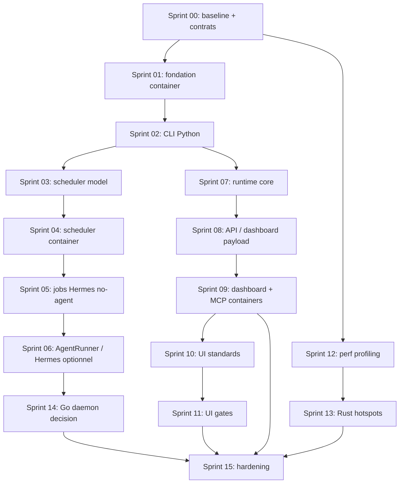

# DEV_CORE v10 -- Roadmap unifiee d'implementation

Date : 2026-07-17
Statut : draft de cadrage
Sources :
- `docs/DEV_CORE_HERMES_REPLACEMENT_PLAN.md`
- `docs/DEV_CORE_v10_Runtime_Orchestration_Plan.md`
- `docs/DEV_CORE_SKILLS_UI_CRAFT_PLAN.md`
- audit de conteneurisation integre depuis `docs/DEV_CORE_v10_CONTAINERIZATION_AUDIT.md`

## 1. Decision d'architecture

DEV_CORE v10 doit devenir container-first, sans migration globale vers Rust ou Go.

Repartition cible :

| Couche | Technologie cible | Role |
|---|---|---|
| Runtime, orchestration, workflows | Python | Cerveau du systeme : planner, executor, checker, scheduler, plugins |
| API externe | Python / FastAPI | Facade REST versionnee pour dashboard, integrations, webhooks |
| Services container | Docker Compose | Runtime reproductible : API, scheduler, workers, Qdrant, Postgres, dashboard |
| Outils performance | Rust | Scan, indexation, watcher, parsing, compression TOON, analyse logs |
| Daemon service optionnel | Go | Service long-running simple si Python ne suffit pas pour supervision reseau |
| Wrappers Windows | PowerShell | Bootstrap host optionnel uniquement |

Principes :

- Python reste le centre de gravite.
- Docker Compose devient le mode d'exploitation principal.
- PowerShell ne doit plus contenir de logique metier critique.
- Hermes devient un adapter optionnel, pas une dependance de runtime.
- Rust et Go ne sont introduits qu'apres mesure, derriere des contrats stables.
- Aucun conteneur ne doit demarrer Docker Desktop, manipuler Windows Scheduled Tasks ou piloter la session Windows.

## 2. Objectif unifie

Construire DEV_CORE v10 comme runtime d'orchestration portable, testable, observable et conteneurise, en :

- lancant les composants principaux via `docker compose up -d` ;
- remplacant progressivement Hermes par des composants DEV_CORE natifs ;
- deplacant la logique PowerShell vers Python ;
- gardant REST comme facade d'integration, sans forcer tous les appels internes en HTTP ;
- stabilisant Docker, volumes, healthchecks et variables d'environnement ;
- ajoutant des skills UI/motion utiles sans alourdir le runtime ;
- mesurant les performances avant toute extraction Rust ou Go.

## 3. Non-objectifs

- Pas de migration complete vers Rust ou Go.
- Pas de deuxieme runtime concurrent au runtime Python.
- Pas de reecriture massive des scripts sans tests.
- Pas de Knowledge Graph UI avant que les audits et gates statiques produisent des donnees utiles.
- Pas de Go daemon tant que les besoins de supervision long-running ne sont pas prouves.
- Pas de REST interne obligatoire entre modules Python du meme process.
- Pas de conteneur qui lance Docker Desktop du host.
- Pas de dependance critique a Windows Scheduled Tasks.
- Pas de `powershell.exe` appele par un service container pour une mutation metier.

## 4. Workstreams et priorites reajustees

| ID | Workstream | Priorite | Resultat attendu |
|---|---|---:|---|
| WS-A | Baseline, contrats, benchmark | P0 | Mesures fiables, contrats CLI/API/container, decisions tracees |
| WS-F | Conteneurisation core | P0 | Compose reproductible avec Qdrant, Postgres, API, router, volumes, healthchecks |
| WS-B | Migration PowerShell vers Python | P0 | `dc.py`, `launch.py`, `diagnose.py`, `tasks.py`, wrappers `.ps1` minces |
| WS-C | Scheduler natif et remplacement Hermes | P0 | Hermes hors chemin critique, scheduler DEV_CORE fiable en container |
| WS-D | Runtime d'orchestration | P1 | Planner, executor, checker, state engine, workflows YAML coherents |
| WS-E | REST/API et dashboard | P1 | API versionnee stable, dashboard plus leger, diagnostics natifs |
| WS-G | Skills/UI/Motion quality | P2 | Standards, audits, gates, plans auto-suffisants |
| WS-H | Performance Rust/Go | P2 | Hotspots extraits seulement si mesures le justifient |

Changement principal : Docker/Compose passe de P1 a P0. La conteneurisation n'est plus un sprint tardif de portabilite, mais une contrainte de fondation.

## 5. Audit de conteneurisation integre

### 5.1 Etat actuel observe

| Element | Etat actuel | Impact conteneurisation |
|---|---|---|
| Dockerfile / Compose | Aucun `Dockerfile` ou `docker-compose.yml` actif dans le repo | Base container a creer |
| Qdrant | Lance via `docker run qdrant/qdrant` dans `launch.ps1` | Deja compatible container, a migrer vers Compose |
| API v1 | FastAPI dans `DEV_CORE/API` | Facile a conteneuriser |
| Gemini Router | FastAPI/uvicorn, bind configurable mais loopback par defaut | Facile avec `0.0.0.0` en container |
| Dashboard API | Python HTTP server + appels `powershell.exe` | Conteneurisable apres retrait des mutations PowerShell |
| Web dashboard | Next.js dans `DEV_CORE/Web` | Facile a conteneuriser |
| Database | Postgres/Alembic present, URL par defaut `127.0.0.1` | Facile avec service `postgres` |
| MCP qdrant-storage | Python, Qdrant hardcode `localhost:6333` | Facile apres env `QDRANT_URL` |
| MCP devcore-scripts | Python mais execute `powershell.exe` | A remplacer par CLI Python |
| Scripts core | 117 scripts `.ps1` detectes | Gros point de migration |
| Python core | 122 fichiers `.py` detectes | Bonne base pour runtime container |
| Hermes daemon | Scheduled Tasks, WMI/CIM, `LOCALAPPDATA`, `msvcrt` | Non portable tel quel |
| Repowise | Executable local sur `127.0.0.1` | Containeriser si binaire Linux disponible, sinon adapter `CodeSearchProvider` |

### 5.2 Architecture container cible

| Service | Image cible | Role | Volume |
|---|---|---|---|
| `runtime` | image Python DEV_CORE | orchestration, CLI, workflows | `devcore_data` |
| `api` | image Python DEV_CORE | FastAPI `/api/v1` | `devcore_data` |
| `scheduler` | image Python DEV_CORE | remplacement Hermes cron | `devcore_data` |
| `worker` | image Python DEV_CORE | jobs longs/asynchrones | `devcore_data` |
| `dashboard-api` | image Python DEV_CORE | backend cockpit et diagnostics | `devcore_data` |
| `dashboard-web` | image Node/Next ou Nginx statique | UI | cache build optionnel |
| `gemini-router` | image Python DEV_CORE | routage LLM/embeddings | secrets env |
| `headroom` | image dediee ou proxy compatible | compression/cache | cache volume |
| `qdrant` | `qdrant/qdrant` | memoire vectorielle | `qdrant_storage` |
| `postgres` | `postgres:16` | DB DEV_CORE | `postgres_data` |
| `mcp-qdrant` | image Python DEV_CORE | MCP Qdrant | aucun |
| `mcp-devcore` | image Python DEV_CORE | MCP DEV_CORE via CLI Python | `devcore_data` |

Principe d'image : une image Python DEV_CORE unique pour `runtime`, `api`, `scheduler`, `worker` et `mcp-*`, avec commandes d'entree differentes.

### 5.3 Matrice de conteneurisation

| Composant | Peut etre conteneurise ? | Action recommandee | Alternative meme performance si blocage |
|---|---:|---|---|
| Qdrant | Oui | Compose `qdrant/qdrant`, volume dedie | Qdrant Cloud si besoin externe |
| Postgres | Oui | Compose `postgres:16`, healthcheck, migrations Alembic | SQLite WAL pour mono-user local |
| FastAPI API v1 | Oui | Uvicorn `0.0.0.0:20131` | Gunicorn/Uvicorn workers si charge plus haute |
| Gemini Router | Oui | `DEVCORE_GEMINI_ROUTER_BIND=0.0.0.0` | Envoy/NGINX devant si TLS/rate limit |
| Dashboard Web | Oui | Next standalone ou export statique | Nginx statique + API backend |
| Dashboard API | Partiel | Retirer `powershell.exe`, appeler API/runtime Python | FastAPI dashboard backend |
| Event bus JSONL | Oui | Porter en Python avec lock cross-platform | Redis Streams, NATS JetStream, Postgres outbox |
| Scheduler Hermes | Non tel quel | Remplacer par scheduler Python container | APScheduler, Celery Beat, Dramatiq, Temporal, supercronic |
| Hermes daemon Windows | Non tel quel | Adapter optionnel hors chemin critique | Scheduler DEV_CORE natif + `AgentRunner` |
| Windows Scheduled Tasks | Non | Remplacer par scheduler container | `supercronic`, Kubernetes CronJob, APScheduler |
| Docker Desktop bootstrap | Non | Host lance Docker/Compose | Podman Compose ou k3d selon besoin |
| WMI/CIM process management | Non | Healthchecks/process supervisor container | s6-overlay, supervisord, Docker healthcheck |
| Notifications Windows | Non | Dashboard notifications, logs, webhooks | Webhook Slack/Teams optionnel |
| Repowise local executable | Incertain | Containeriser si binaire Linux/image disponible | Rust/Tantivy, ripgrep sidecar, Sourcegraph local, OpenGrok |
| Obsidian vault | Oui comme donnees | Bind mount `DEV_CORE_DATA/Vault` | Git-backed markdown vault |
| MCP qdrant-storage | Oui | Rendre `QDRANT_URL` configurable | Integrer au runtime si MCP inutile |
| MCP devcore-scripts | Partiel | Remplacer `powershell.exe` par CLI Python | Image PowerShell 7 temporaire |
| TOON CLI | Oui | Installer dans image Node ou extraire en Rust | `devcore-toon` Rust |
| Secret scan | Oui | Python/Rust worker | `gitleaks` container |
| Tests Playwright | Oui | Image Playwright separee | CI hors Compose si trop lourd |

### 5.4 Configuration container obligatoire

| Sujet | Actuel | Cible container |
|---|---|---|
| `DEVCORE_PLATFORM_ROOT` | `C:\devcore\DEV_CORE` | `/app/DEV_CORE` |
| `DEVCORE_DATA_ROOT` | `C:\devcore\DEV_CORE_DATA` | `/data` |
| Qdrant URL | `http://localhost:6333` | `http://qdrant:6333` |
| Postgres URL | `127.0.0.1:5432` | `postgres:5432` |
| Gemini router | `127.0.0.1:20130` | `http://gemini-router:20130` |
| Dashboard API bind | `127.0.0.1` | `0.0.0.0` dans container |
| API bind | `127.0.0.1` | `0.0.0.0` dans container |
| secrets | fichiers locaux possibles | env/secrets mounts |
| logs | `DEV_CORE_DATA\Logs` | `/data/Logs` |

Tous les services doivent parler par noms Compose, pas par `localhost`, sauf appels internes au meme conteneur.

## 6. Contrats techniques obligatoires

### 6.1 CLI Python

Chaque commande Python exposee par wrapper PowerShell doit respecter :

- sortie machine lisible en JSON pour les commandes automatisees ;
- sortie humaine concise pour l'usage interactif ;
- codes de sortie stables ;
- logs ecrits dans `DEV_CORE_DATA/Logs`, pas uniquement stdout ;
- tests unitaires pour parsing, erreurs et idempotence.

### 6.2 Contrats container

Chaque service container doit respecter :

- un `command` explicite ;
- variables d'environnement documentees ;
- aucun chemin Windows obligatoire ;
- readiness/healthcheck ;
- donnees persistantes dans volume ;
- logs stdout/stderr + `/data/Logs` si necessaire ;
- arret propre sur SIGTERM ;
- pas de mutation metier via `powershell.exe`.

### 6.3 Rust tools

Les outils Rust communiquent d'abord par process boundary :

- input : arguments CLI, fichier, stdin JSON/JSONL ;
- output : stdout JSON/JSONL ;
- erreurs : stderr humain + code de sortie ;
- pas d'acces direct non documente a l'etat runtime ;
- version exposee via `--version` et `--capabilities`.

Passer a gRPC/REST seulement si l'outil devient long-running.

### 6.4 Go services

Go est autorise uniquement si au moins un critere est vrai :

- besoin d'un daemon long-running autonome ;
- supervision de processus multi-plateforme ;
- service reseau a haute disponibilite ;
- Python montre une limite mesuree sur latence, memoire ou stabilite.

Sinon, rester en Python.

### 6.5 API REST

REST sert de facade externe :

- dashboard ;
- integrations ;
- webhooks ;
- diagnostics ;
- controle runtime a distance.

REST ne doit pas remplacer les appels Python internes quand les modules vivent dans le meme runtime.

## 7. Roadmap par sprints

Cadence recommandee : sprint court de 3 a 5 jours pour garder les livrables verifiables.

### Sprint 00 -- Baseline, audit executable et contrats

Priorite : P0
Objectif : figer l'etat initial, les contrats container et les mesures de reference.

Livrables :

- Inventaire des scripts PowerShell, modules Python, endpoints API, jobs Hermes et services container cibles.
- Matrice "garder / migrer / wrapper / supprimer / containeriser".
- Baseline `devcore benchmark` minimale.
- Baseline `devcore profile` sur `launch`, `dc next task`, dashboard generation, task scan.
- ADR "Container-first, Python core, Rust tools, Go optional daemon, PowerShell host wrappers".
- Spec Compose cible minimal.

Critere d'acceptation :

- Chaque futur sprint a une mesure de reference ou une raison explicite de ne pas en avoir.
- Les services P0 ont leurs variables, ports, volumes et healthchecks definis.

### Sprint 01 -- Fondation container P0

Priorite : P0
Objectif : obtenir une tranche verticale conteneurisee minimale.

Livrables :

- `DEV_CORE/docker/Dockerfile.python`.
- `.dockerignore`.
- `docker-compose.yml` minimal : `qdrant`, `postgres`, `api`, `gemini-router`.
- API FastAPI bindee sur `0.0.0.0` en container.
- Variables : `DEVCORE_PLATFORM_ROOT=/app/DEV_CORE`, `DEVCORE_DATA_ROOT=/data`, `QDRANT_URL=http://qdrant:6333`, `DEVCORE_DATABASE_URL=...@postgres:5432/...`.
- Healthchecks Qdrant, Postgres, API.
- Smoke test `docker compose up -d` puis `GET /api/v1/health`.

Critere d'acceptation :

- Un environnement propre lance Qdrant, Postgres, API et Gemini Router sans `launch.ps1`.

### Sprint 02 -- CLI Python foundation

Priorite : P0
Objectif : creer la colonne vertebrale Python qui remplacera progressivement les `.ps1`.

Livrables :

- `dc.py` avec sous-commandes initiales : `next task`, `doctor`, `benchmark`, `profile`.
- Wrappers `dc.ps1` minces vers Python.
- Module commun de config, chemins, logs, erreurs.
- Tests unitaires sur resolution projet actif, chemins DEV_CORE, codes de sortie.
- `launch.ps1` reduit a wrapper host optionnel : verifier Docker puis `docker compose up -d`.

Critere d'acceptation :

- `dc.ps1` continue de fonctionner, mais la logique principale vit dans Python.
- Le core DEV_CORE peut demarrer en container sans executer de logique metier PowerShell.

### Sprint 03 -- Scheduler model natif

Priorite : P0
Objectif : creer le modele scheduler DEV_CORE avant de remplacer Hermes.

Livrables :

- Schema `scheduler/jobs.json`.
- Schema run history.
- Calcul `next_run`.
- Policies : `skip`, `run_once`, `catch_up`.
- Gestion timezone et DST.
- Idempotency key : `job_id + scheduled_at`.
- Tests unitaires du calcul de planning.

Critere d'acceptation :

- Le scheduler DEV_CORE peut predire les memes prochains runs que Hermes pour les jobs critiques.

### Sprint 04 -- Scheduler container et tick loop

Priorite : P0
Objectif : executer les jobs natifs dans un conteneur sans double execution.

Livrables :

- Service Compose `scheduler`.
- `scheduler_tick.py` ou loop scheduler Python.
- Lock avec lease et heartbeat.
- Ecriture atomique de run history.
- Retry/backoff.
- Mode `shadow` sans execution.
- Mode actif avec un seul writer.
- Tests d'idempotence, lock et reprise apres crash.

Critere d'acceptation :

- Deux ticks concurrents ne lancent jamais deux fois le meme job.
- Le scheduler fonctionne sans Windows Scheduled Tasks.

### Sprint 05 -- Migration des jobs Hermes no-agent

Priorite : P0
Objectif : sortir les jobs systeme simples du chemin critique Hermes.

Livrables :

- Migration des jobs `no_agent: true`.
- Comparaison shadow Hermes vs DEV_CORE.
- Rapport de divergence.
- Plan de rollback.
- Dashboard health minimal du scheduler.

Critere d'acceptation :

- Les jobs migres tournent via DEV_CORE pendant une periode de soak sans divergence critique.

### Sprint 06 -- Agent Runner abstraction et Hermes optionnel

Priorite : P0
Objectif : isoler Hermes derriere une interface interchangeable.

Livrables :

- Interface `AgentRunner`.
- Adapters : Hermes, local process, Codex/manual.
- Capabilities par runner.
- Selection runner par config.
- Healthcheck runner.
- Documentation de rollback Hermes.

Critere d'acceptation :

- Hermes peut etre desactive sans casser scheduler, dashboard, diagnostics et jobs no-agent.

### Sprint 07 -- Runtime orchestration core

Priorite : P1
Objectif : transformer le plan runtime en integration du systeme existant, pas en reecriture.

Livrables :

- Gap analysis entre runtime cible et composants deja presents.
- State engine minimal.
- Workflow YAML schema v1.
- Planner, executor, checker raccordes au state engine.
- Event bus raccorde au read model existant.
- Tests de workflow nominal, erreur, reprise.

Critere d'acceptation :

- Un workflow simple peut etre planifie, execute, verifie et repris apres interruption.

### Sprint 08 -- REST/API contracts et dashboard payload

Priorite : P1
Objectif : stabiliser la facade REST et reduire le cout dashboard.

Livrables :

- OpenAPI versionnee pour runtime, scheduler, tasks, health, metrics.
- Contrats Pydantic versionnes.
- Dashboard read model separe du shell UI.
- Pagination ou bornage des historiques lourds.
- Endpoint diagnostics scheduler/runtime.
- Tests de contrats API.

Critere d'acceptation :

- Le dashboard ne depend plus d'un payload monolithique non borne.

### Sprint 09 -- Dashboard, MCP et services containers

Priorite : P1
Objectif : completer la surface container apres la tranche core.

Livrables :

- Service `dashboard-api` sans mutation PowerShell.
- Service `dashboard-web` Next/Nginx.
- Service `mcp-qdrant` avec `QDRANT_URL`.
- Service `mcp-devcore` via CLI Python, sans `powershell.exe`.
- Volumes `devcore_data`, `qdrant_storage`, `postgres_data`.
- Tests smoke dashboard/API/MCP.

Critere d'acceptation :

- Dashboard, API, MCP Qdrant et runtime fonctionnent via Compose avec noms de services internes.

### Sprint 10 -- Skills/UI/Motion standards

Priorite : P2
Objectif : commencer petit, avec des standards applicables.

Livrables :

- `MOTION_STANDARDS.md`.
- Skill `dashboard-ui-craft`.
- Skill `motion-review` avec mode audit.
- Checklist accessibilite minimale.
- Audit read-only du dashboard.

Critere d'acceptation :

- Les findings UI/motion sont fichier/ligne, priorises et actionnables.

### Sprint 11 -- UI gates et corrections prioritaires

Priorite : P2
Objectif : empecher les regressions simples et corriger les problemes P0/P1.

Livrables :

- Gate statique contre `transition: all`.
- Gate reduced-motion.
- Gate animation de proprietes layout couteuses.
- Plans auto-suffisants pour findings P0/P1.
- Corrections P0/P1 dashboard.

Critere d'acceptation :

- Les regressions UI/motion basiques echouent en CI ou en verification locale.

### Sprint 12 -- Performance profiling et candidats Rust

Priorite : P2
Objectif : decider les extractions Rust sur preuves.

Livrables :

- Rapport perf sur scan fichiers, logs, TOON, dashboard generation, search locale.
- Budget cible par composant : p50, p95, memoire, taille payload.
- Decision matrix Python vs Rust.
- Prototype Rust unique si un hotspot est prouve.
- Contrat JSON/JSONL pour le prototype.

Critere d'acceptation :

- Aucun outil Rust n'est accepte sans benchmark avant/apres et contrat stable.

### Sprint 13 -- Watcher/indexer/log analyzer Rust

Priorite : P2 conditionnelle
Objectif : extraire les hotspots confirmes.

Livrables conditionnels :

- `devcore-scan` si scan massif est un bottleneck.
- `devcore-watch` si watcher Python est insuffisant.
- `devcore-toon` si compression/conversion est critique.
- `devcore-log-analyzer` si logs volumineux ralentissent les diagnostics.
- Integration Python via process boundary.

Critere d'acceptation :

- Gain mesure au moins 2x sur le hotspot cible ou reduction memoire significative.

### Sprint 14 -- Evaluation Go daemon

Priorite : P3 conditionnelle
Objectif : verifier si Go apporte une vraie valeur pour un daemon DEV_CORE.

Livrables :

- Decision record "Go daemon oui/non".
- Prototype uniquement si besoin confirme.
- Scope limite : supervision, health, event relay ou service manager.
- Comparaison Python long-running vs Go daemon.

Critere d'acceptation :

- Go est adopte seulement si le prototype reduit la complexite operationnelle ou ameliore clairement la robustesse.

### Sprint 15 -- Hardening v10 container-first

Priorite : P0 release
Objectif : stabiliser avant annonce v10.

Livrables :

- Tests bout en bout `docker compose up` -> API health -> scheduler -> dashboard -> endday.
- Tests rollback Hermes.
- Documentation operateur container.
- Documentation developpeur.
- Guide migration v9/v10.
- Nettoyage des scripts obsoletes ou marquage deprecated.

Critere d'acceptation :

- DEV_CORE v10 fonctionne avec Hermes optionnel, runtime Python actif, API stable, Compose smoke OK, et PowerShell limite aux wrappers host Windows.

## 8. Ordre de dependances

## 9. Priorites pratiques

| Priorite | Sprints | Pourquoi |
|---|---|---|
| P0 | 00-06, 15 | Container core, base Python testable, remplacement Hermes, release hardening |
| P1 | 07-09 | Runtime, API, dashboard/MCP containers |
| P2 | 10-13 | Qualite UI et performance ciblee |
| P3 | 14 | Go seulement si besoin service confirme |

## 10. Definition de Done globale

La roadmap est terminee quand :

- `docker compose up -d` lance Qdrant, Postgres, API, Router, Scheduler, Dashboard et MCP critiques.
- `launch.ps1` n'est plus necessaire au fonctionnement core.
- Aucun service container n'appelle `powershell.exe` pour une mutation metier.
- Tous les chemins utilisent `DEVCORE_PLATFORM_ROOT` et `DEVCORE_DATA_ROOT`.
- Les services parlent entre eux par noms Compose, pas `localhost`.
- Les donnees persistantes sont dans volumes.
- Les healthchecks passent.
- Hermes n'est plus dans le chemin critique.
- Les wrappers PowerShell ne contiennent plus de logique metier.
- Le runtime Python orchestre tasks, scheduler, workflows et plugins.
- L'API REST expose les contrats externes stables.
- Les performances critiques sont mesurees.
- Les extractions Rust ont un benchmark avant/apres.
- Go est soit explicitement rejete, soit limite a un daemon justifie.
- Les standards UI/motion produisent des findings actionnables et des gates utiles.

## 11. Risques et mitigations

| Risque | Impact | Mitigation |
|---|---|---|
| Compose cree trop tard | Portabilite repoussee, dette Windows durable | Sprint 01 container P0 |
| Reecriture trop large | Retard, regressions | Migrer verticalement par commandes et jobs |
| Double execution Hermes/DEV_CORE | Jobs dupliques | Shadow read-only, un seul writer actif |
| REST utilise partout en interne | Latence et complexite | REST seulement facade externe |
| `localhost` conserve entre containers | Services injoignables | Noms Compose obligatoires |
| Secrets dans images | Fuite de secrets | env/secrets mounts, jamais baked dans image |
| PowerShell dans services containers | Non-portabilite persistante | CLI Python obligatoire pour mutations metier |
| Rust introduit trop tot | Maintenance accrue | Exiger benchmark et contrat stable |
| Go daemon premature | Deuxieme runtime inutile | ADR obligatoire avant prototype |
| Dashboard trop lourd | Lenteur percue | Read model borne, pagination, payload separe |
| Skills UI trop nombreux | Bruit et lenteur | Commencer par standards, audit, gates P0/P1 |
| Docker casse les usages Windows | Perte de compatibilite | Garder wrappers PowerShell host minces |

## 12. Prochaine action recommandee

Demarrer par Sprint 00 avec un livrable unique : `DEV_CORE_v10_GAP_BASELINE_AND_CONTAINER_SPEC.md`.

Ce document doit contenir :

- inventaire des composants existants ;
- mapping vers les sprints ci-dessus ;
- mesures actuelles ;
- spec Compose cible minimal ;
- liste des ports, volumes, variables et healthchecks ;
- decisions "migrer maintenant / garder / mesurer / abandonner" ;
- liste des tests manquants avant Sprint 01.
