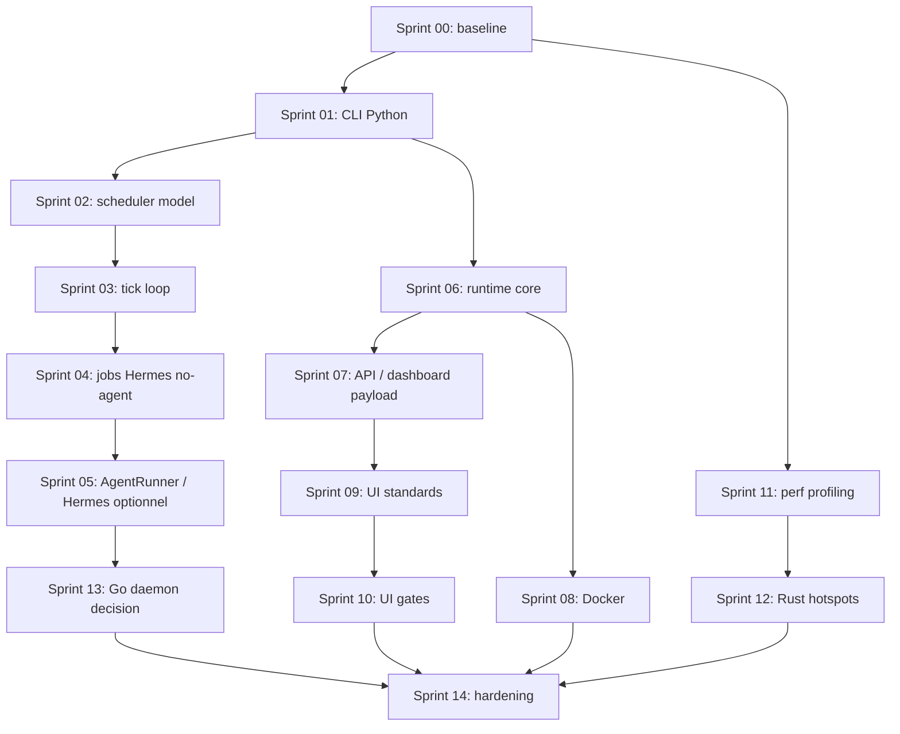

# DEV_CORE v10 -- Roadmap unifiee d'implementation

Date : 2026-07-14  
Statut : draft de cadrage  
Sources :
- `docs/DEV_CORE_HERMES_REPLACEMENT_PLAN.md`
- `docs/DEV_CORE_v10_Runtime_Orchestration_Plan.md`
- `docs/DEV_CORE_SKILLS_UI_CRAFT_PLAN.md`

## 1. Decision d'architecture

DEV_CORE v10 doit converger vers une architecture hybride, mais sans migration globale vers Rust ou Go.

Repartition cible :

| Couche | Technologie cible | Role |
|---|---|---|
| Runtime, orchestration, workflows | Python | Cerveau du systeme : planner, executor, checker, scheduler, plugins |
| API externe | Python / FastAPI | Facade REST versionnee pour dashboard, integrations, webhooks |
| Outils performance | Rust | Scan, indexation, watcher, parsing, compression TOON, analyse logs |
| Daemon service optionnel | Go | Service long-running simple si Python ne suffit pas pour supervision reseau |
| Wrappers Windows | PowerShell | Bootstrap, compatibilite Windows, scheduled tasks uniquement |

Principe : Python reste le centre de gravite. Rust et Go ne sont introduits qu'apres mesure, derriere des contrats stables, et jamais comme reecriture totale.

## 2. Objectif unifie

Construire DEV_CORE v10 comme runtime d'orchestration portable, testable et observable, en :

- remplacant progressivement Hermes par des composants DEV_CORE natifs ;
- deplacant la logique PowerShell vers Python ;
- gardant REST comme facade d'integration, sans forcer tous les appels internes en HTTP ;
- stabilisant Docker et les workflows ;
- ajoutant des skills UI/motion utiles sans alourdir le runtime ;
- mesurant les performances avant toute extraction Rust ou Go.

## 3. Non-objectifs

- Pas de migration complete vers Rust ou Go.
- Pas de deuxieme runtime concurrent au runtime Python.
- Pas de reecriture massive des scripts sans tests.
- Pas de Knowledge Graph UI avant que les audits et gates statiques produisent des donnees utiles.
- Pas de Go daemon tant que les besoins de supervision long-running ne sont pas prouves.
- Pas de REST interne obligatoire entre modules Python du meme process.

## 4. Workstreams

| ID | Workstream | Priorite | Resultat attendu |
|---|---|---:|---|
| WS-A | Baseline, contrats, benchmark | P0 | Mesures fiables, contrats CLI/API, decisions tracees |
| WS-B | Migration PowerShell vers Python | P0 | `dc.py`, `launch.py`, `diagnose.py`, `tasks.py`, wrappers `.ps1` minces |
| WS-C | Scheduler natif et remplacement Hermes | P0 | Hermes hors chemin critique, scheduler DEV_CORE fiable |
| WS-D | Runtime d'orchestration | P1 | Planner, executor, checker, state engine, workflows YAML coherents |
| WS-E | REST/API et dashboard | P1 | API versionnee stable, dashboard plus leger, diagnostics natifs |
| WS-F | Docker et portabilite | P1 | Compose reproductible avec runtime, API, Qdrant, dashboard |
| WS-G | Skills/UI/Motion quality | P2 | Standards, audits, gates, plans auto-suffisants |
| WS-H | Performance Rust/Go | P2 | Hotspots extraits seulement si mesures le justifient |

## 5. Contrats techniques obligatoires

### 5.1 CLI Python

Chaque commande Python exposee par wrapper PowerShell doit respecter :

- sortie machine lisible en JSON pour les commandes automatisees ;
- sortie humaine concise pour l'usage interactif ;
- codes de sortie stables ;
- logs ecrits dans `DEV_CORE_DATA/Logs`, pas uniquement stdout ;
- tests unitaires pour parsing, erreurs et idempotence.

### 5.2 Rust tools

Les outils Rust communiquent d'abord par process boundary :

- input : arguments CLI, fichier, stdin JSON/JSONL ;
- output : stdout JSON/JSONL ;
- erreurs : stderr humain + code de sortie ;
- pas d'acces direct non documente a l'etat runtime ;
- version exposee via `--version` et `--capabilities`.

Passer a gRPC/REST seulement si l'outil devient long-running.

### 5.3 Go services

Go est autorise uniquement si au moins un critere est vrai :

- besoin d'un daemon long-running autonome ;
- supervision de processus multi-plateforme ;
- service reseau a haute disponibilite ;
- Python montre une limite mesuree sur latence, memoire ou stabilite.

Sinon, rester en Python.

### 5.4 API REST

REST sert de facade externe :

- dashboard ;
- integrations ;
- webhooks ;
- diagnostics ;
- controle runtime a distance.

REST ne doit pas remplacer les appels Python internes quand les modules vivent dans le meme runtime.

## 6. Roadmap par sprints

Cadence recommandee : sprint court de 3 a 5 jours pour garder les livrables verifiables.

### Sprint 00 -- Baseline et cadrage

Priorite : P0  
Objectif : figer l'etat initial et eviter les migrations non mesurees.

Livrables :

- Inventaire des scripts PowerShell, modules Python, endpoints API et jobs Hermes.
- Matrice "garder / migrer / wrapper / supprimer".
- Baseline `devcore benchmark` minimale.
- Baseline `devcore profile` sur `launch`, `dc next task`, dashboard generation, task scan.
- ADR "Python core, Rust tools, Go optional daemon, PowerShell wrappers".

Critere d'acceptation :

- Chaque futur sprint a une mesure de reference ou une raison explicite de ne pas en avoir.

### Sprint 01 -- CLI Python foundation

Priorite : P0  
Objectif : creer la colonne vertebrale Python qui remplacera progressivement les `.ps1`.

Livrables :

- `dc.py` avec sous-commandes initiales : `next task`, `doctor`, `benchmark`, `profile`.
- Wrappers `dc.ps1` minces vers Python.
- Module commun de config, chemins, logs, erreurs.
- Tests unitaires sur resolution projet actif, chemins DEV_CORE, codes de sortie.

Critere d'acceptation :

- `dc.ps1` continue de fonctionner, mais la logique principale vit dans Python.

### Sprint 02 -- Scheduler model natif

Priorite : P0  
Objectif : creer le modele scheduler DEV_CORE avant de remplacer Hermes.

Livrables :

- Schema `scheduler/jobs.json`.
- Schema run history.
- Calcul `next_run`.
- Policies : `skip`, `run_once`, `catch_up`.
- Gestion timezone et DST.
- Idempotency key : `job_id + scheduled_at`.
- Tests unitaires du calcul de planning.

Critere d'acceptation :

- Le scheduler DEV_CORE peut predire les memes prochains runs que Hermes pour les jobs critiques.

### Sprint 03 -- Tick loop et execution controlee

Priorite : P0  
Objectif : executer les jobs natifs sans double execution.

Livrables :

- `scheduler_tick.py`.
- Lock avec lease et heartbeat.
- Ecriture atomique de run history.
- Retry/backoff.
- Mode `shadow` sans execution.
- Mode actif avec un seul writer.
- Tests d'idempotence, lock et reprise apres crash.

Critere d'acceptation :

- Deux ticks concurrents ne lancent jamais deux fois le meme job.

### Sprint 04 -- Migration des jobs Hermes no-agent

Priorite : P0  
Objectif : sortir les jobs systeme simples du chemin critique Hermes.

Livrables :

- Migration des jobs `no_agent: true`.
- Comparaison shadow Hermes vs DEV_CORE.
- Rapport de divergence.
- Plan de rollback.
- Dashboard health minimal du scheduler.

Critere d'acceptation :

- Les jobs migres tournent via DEV_CORE pendant une periode de soak sans divergence critique.

### Sprint 05 -- Agent Runner abstraction et Hermes optionnel

Priorite : P0  
Objectif : isoler Hermes derriere une interface interchangeable.

Livrables :

- Interface `AgentRunner`.
- Adapters : Hermes, local process, Codex/manual.
- Capabilities par runner.
- Selection runner par config.
- Healthcheck runner.
- Documentation de rollback Hermes.

Critere d'acceptation :

- Hermes peut etre desactive sans casser scheduler, dashboard, diagnostics et jobs no-agent.

### Sprint 06 -- Runtime orchestration core

Priorite : P1  
Objectif : transformer le plan runtime en integration du systeme existant, pas en reecriture.

Livrables :

- Gap analysis entre runtime cible et composants deja presents.
- State engine minimal.
- Workflow YAML schema v1.
- Planner, executor, checker raccordes au state engine.
- Event bus raccorde au read model existant.
- Tests de workflow nominal, erreur, reprise.

Critere d'acceptation :

- Un workflow simple peut etre planifie, execute, verifie et repris apres interruption.

### Sprint 07 -- REST/API contracts et dashboard payload

Priorite : P1  
Objectif : stabiliser la facade REST et reduire le cout dashboard.

Livrables :

- OpenAPI versionnee pour runtime, scheduler, tasks, health, metrics.
- Contrats Pydantic versionnes.
- Dashboard read model separe du shell UI.
- Pagination ou bornage des historiques lourds.
- Endpoint diagnostics scheduler/runtime.
- Tests de contrats API.

Critere d'acceptation :

- Le dashboard ne depend plus d'un payload monolithique non borne.

### Sprint 08 -- Docker et portabilite

Priorite : P1  
Objectif : rendre DEV_CORE v10 reproductible hors poste Windows.

Livrables :

- `docker-compose` runtime Python, API, Qdrant, dashboard.
- Variables d'environnement documentees.
- Volumes pour `DEV_CORE_DATA`.
- Healthchecks containers.
- Mode Windows avec wrappers PowerShell conserves.
- Test smoke Docker.

Critere d'acceptation :

- Un environnement propre peut lancer runtime, API et Qdrant sans dependance aux scheduled tasks Windows.

### Sprint 09 -- Skills/UI/Motion standards

Priorite : P2  
Objectif : commencer petit, avec des standards applicables.

Livrables :

- `MOTION_STANDARDS.md`.
- Skill `dashboard-ui-craft`.
- Skill `motion-review` avec mode audit.
- Checklist accessibilite minimale.
- Audit read-only du dashboard.

Critere d'acceptation :

- Les findings UI/motion sont fichier/ligne, priorises et actionnables.

### Sprint 10 -- UI gates et corrections prioritaires

Priorite : P2  
Objectif : empecher les regressions simples et corriger les problemes P0/P1.

Livrables :

- Gate statique contre `transition: all`.
- Gate reduced-motion.
- Gate animation de proprietes layout couteuses.
- Plans auto-suffisants pour findings P0/P1.
- Corrections P0/P1 dashboard.

Critere d'acceptation :

- Les regressions UI/motion basiques echouent en CI ou en verification locale.

### Sprint 11 -- Performance profiling et candidats Rust

Priorite : P2  
Objectif : decider les extractions Rust sur preuves.

Livrables :

- Rapport perf sur scan fichiers, logs, TOON, dashboard generation, search locale.
- Budget cible par composant : p50, p95, memoire, taille payload.
- Decision matrix Python vs Rust.
- Prototype Rust unique si un hotspot est prouve.
- Contrat JSON/JSONL pour le prototype.

Critere d'acceptation :

- Aucun outil Rust n'est accepte sans benchmark avant/apres et contrat stable.

### Sprint 12 -- Watcher/indexer/log analyzer Rust

Priorite : P2 conditionnelle  
Objectif : extraire les hotspots confirmes.

Livrables conditionnels :

- `devcore-scan` si scan massif est un bottleneck.
- `devcore-watch` si watcher Python est insuffisant.
- `devcore-toon` si compression/conversion est critique.
- `devcore-log-analyzer` si logs volumineux ralentissent les diagnostics.
- Integration Python via process boundary.

Critere d'acceptation :

- Gain mesure au moins 2x sur le hotspot cible ou reduction memoire significative.

### Sprint 13 -- Evaluation Go daemon

Priorite : P3 conditionnelle  
Objectif : verifier si Go apporte une vraie valeur pour un daemon DEV_CORE.

Livrables :

- Decision record "Go daemon oui/non".
- Prototype uniquement si besoin confirme.
- Scope limite : supervision, health, event relay ou service manager.
- Comparaison Python long-running vs Go daemon.

Critere d'acceptation :

- Go est adopte seulement si le prototype reduit la complexite operationnelle ou ameliore clairement la robustesse.

### Sprint 14 -- Hardening v10

Priorite : P0 release  
Objectif : stabiliser avant annonce v10.

Livrables :

- Tests bout en bout launch -> task -> scheduler -> dashboard -> endday.
- Tests rollback Hermes.
- Documentation operateur.
- Documentation developpeur.
- Guide migration v9/v10.
- Nettoyage des scripts obsoletes ou marquage deprecated.

Critere d'acceptation :

- DEV_CORE v10 fonctionne avec Hermes optionnel, runtime Python actif, API stable, Docker smoke OK, et PowerShell limite aux wrappers Windows.

## 7. Ordre de dependances

## 8. Priorites pratiques

| Priorite | Sprints | Pourquoi |
|---|---|---|
| P0 | 00-05, 14 | Fiabilite runtime, remplacement Hermes, base Python testable |
| P1 | 06-08 | Orchestration, API, Docker |
| P2 | 09-12 | Qualite UI et performance ciblee |
| P3 | 13 | Go seulement si besoin service confirme |

## 9. Definition de Done globale

La roadmap est terminee quand :

- Hermes n'est plus dans le chemin critique.
- Les wrappers PowerShell ne contiennent plus de logique metier.
- Le runtime Python orchestre tasks, scheduler, workflows et plugins.
- L'API REST expose les contrats externes stables.
- Docker lance les composants principaux.
- Les performances critiques sont mesurees.
- Les extractions Rust ont un benchmark avant/apres.
- Go est soit explicitement rejete, soit limite a un daemon justifie.
- Les standards UI/motion produisent des findings actionnables et des gates utiles.

## 10. Risques et mitigations

| Risque | Impact | Mitigation |
|---|---|---|
| Reecriture trop large | Retard, regressions | Migrer verticalement par commandes et jobs |
| Double execution Hermes/DEV_CORE | Jobs dupliques | Shadow read-only, un seul writer actif |
| REST utilise partout en interne | Latence et complexite | REST seulement facade externe |
| Rust introduit trop tot | Maintenance accrue | Exiger benchmark et contrat stable |
| Go daemon premature | Deuxieme runtime inutile | ADR obligatoire avant prototype |
| Dashboard trop lourd | Lenteur percue | Read model borne, pagination, payload separe |
| Skills UI trop nombreux | Bruit et lenteur | Commencer par standards, audit, gates P0/P1 |
| Docker casse les usages Windows | Perte de compatibilite | Garder wrappers PowerShell minces |

## 11. Prochaine action recommandee

Demarrer par Sprint 00 avec un livrable unique : `DEV_CORE_v10_GAP_AND_BASELINE.md`.

Ce document doit contenir :

- inventaire des composants existants ;
- mapping vers les sprints ci-dessus ;
- mesures actuelles ;
- decisions "migrer maintenant / garder / mesurer / abandonner" ;
- liste des tests manquants avant Sprint 01.
