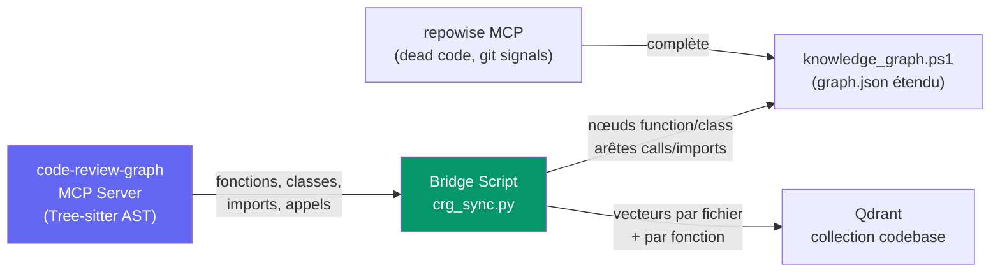
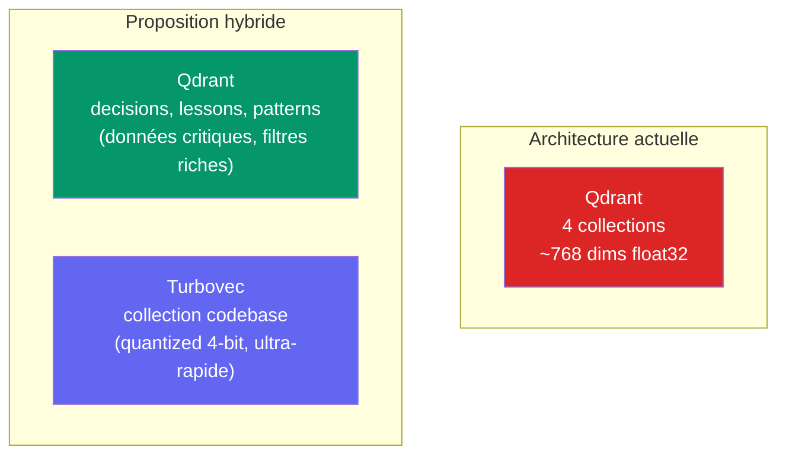

# Analyse : 3 Repos × DEV_CORE — Fonctionnalités Transférables

> Repos analysés : [openinterpreter](https://github.com/openinterpreter/openinterpreter), [code-review-graph](https://github.com/tirth8205/code-review-graph), [turbovec](https://github.com/RyanCodrai/turbovec)
> Architecture DEV_CORE auditée : 11 outils MCP, router 3 moteurs, plugin_service.ps1 (883 lignes), knowledge_graph.ps1 (470 lignes), qdrant_sync.ps1 (315 lignes)

---

## Résumé Exécutif

| Repo | Verdict | Fonctionnalités à transférer | Impact |
|---|---|---|---|
| **OpenInterpreter** | 🟢 **2 fonctionnalités transférables** | Multi-Harness agent + Pre/Post Tool Hooks | Élevé |
| **code-review-graph** | 🟢 **COUP DE CŒUR — intégrer comme MCP** | Tree-sitter AST → graphe SQLite incrémental | Critique |
| **Turbovec** | 🟡 **Accélérateur ciblé, pas remplacement** | Quantization 2-bit pour codebase locale | Moyen |

---

## 1. OpenInterpreter

### Ce que fait le repo

OpenInterpreter est un agent de coding Rust-natif qui exécute du code localement avec :
- **Multi-Harness** : profils d'agent interchangeables à chaud (`native`, `claude-code`, `swe-agent`, `kimi-cli`, `qwen-code`)
- **Pre/Post Tool Hooks** : intercepteurs avant/après chaque exécution d'outil
- **Native Sandboxing** : exécution sécurisée cross-platform
- **ACP (Agent Client Protocol)** : intégration standardisée avec les IDEs
- **Skills répétables** + fichier `AGENTS.md` par projet

### Ce que DEV_CORE possède déjà

| Capacité OI | Existant DEV_CORE | Écart |
|---|---|---|
| Multi-Harness (6+ profils agent) | [router.py](file:///c:/devcore/DEV_CORE/Tools/devcore/router.py) : 3 moteurs **codés en dur** (claude/codex/gemini) avec scoring fixe | 🔴 **Le router est rigide** — pas de profils interchangeables |
| Pre/Post Tool Hooks | [plugin_service.ps1](file:///c:/devcore/DEV_CORE/Scripts/plugin_service.ps1) : isolation processus, mais **zéro hook sur les 11 outils MCP** | 🔴 **Aucun système de hooks** |
| Native Sandboxing | `plugin_service.ps1` : `Set-IsolatedProcessEnvironment` (env whitelist) — isolation plugin seulement, pas d'exécution de code arbitraire | 🟡 Partiel (plugins uniquement) |
| ACP (IDE integration) | Aucun — les MCP servers sont la seule interface | 🟡 Non critique pour le moment |
| AGENTS.md par projet | `.devcore/project.json` + `AGENTS.md` config dans le repo | ✅ Couvert |
| Skills répétables | `skills_registry.json` (11 skills) + `auto_skills_detector.ps1` | ✅ Couvert |

### Fonctionnalités à transférer

#### 1A. Système de Harness Agent (étendre le router)

Le router actuel est **statique** : 3 moteurs codés en dur dans `router.py` avec des poids de scoring fixes. Le concept de "harness" d'OpenInterpreter est plus puissant — chaque harness définit :
- Les instructions système optimales pour un modèle
- Le comportement des outils (format d'appel, parsing de réponse)
- La gestion du contexte (taille de fenêtre, stratégie de troncature)

**Proposition** : Étendre le [ai_capability_registry.json](file:///c:/devcore/DEV_CORE/Config/ai_capability_registry.json) et les [routing_profiles.json](file:///c:/devcore/DEV_CORE/Config/routing_profiles.json) pour supporter des "harness profiles" déclaratifs :

```json
{
  "harness_id": "deep-analysis",
  "display_name": "Deep Analysis Harness",
  "model": "gemini-2.5-pro",
  "system_prompt_template": "prompts/deep_analysis.md",
  "context_budget": 32768,
  "tool_format": "native",
  "temperature": 0.3,
  "stop_sequences": [],
  "pre_hooks": ["token_budget_check", "context_freshness_check"],
  "post_hooks": ["token_usage_log", "quality_score_update"],
  "fallback_harness": "coding"
}
```

> [!IMPORTANT]
> Ceci s'aligne avec le **Sprint 06** existant (AgentRunner abstraction) qui est déjà planifié mais n'a pas encore de spec de harness. Le concept OI peut enrichir directement ce sprint.

**Fichiers à modifier** : `Config/routing_profiles.json`, `Tools/devcore/router.py`, `Config/ai_capability_registry.json`

#### 1B. Pre/Post Tool Hooks sur les outils MCP

Les 11 outils MCP de [devcore-scripts/server.py](file:///c:/devcore/DEV_CORE/MCP/devcore-scripts/server.py) sont des wrappers directs vers PowerShell sans aucune interception. OI propose des hooks `PreToolUse` et `PostToolUse` qui permettent :
- **Guardrails** : vérifier les permissions avant exécution
- **Télémétrie** : mesurer le temps d'exécution, les tokens consommés
- **Audit trail** : logger chaque appel d'outil dans l'event bus
- **Circuit breaker** : bloquer un outil après N échecs

**Proposition** : Ajouter un système de hooks dans `server.py` :

```python
# Registre de hooks
PRE_HOOKS = {
    "*": [token_budget_check, audit_log_entry],
    "devcore_endday": [qdrant_health_check],
}
POST_HOOKS = {
    "*": [token_usage_log, rtk_compress],
    "devcore_task_done": [trigger_lesson_extraction],
}

async def handle_tool_call(tool_name, arguments):
    # Pre-hooks
    for hook in PRE_HOOKS.get("*", []) + PRE_HOOKS.get(tool_name, []):
        arguments = await hook(tool_name, arguments)
    
    # Exécution
    result = await dispatch[tool_name](arguments)
    
    # Post-hooks
    for hook in POST_HOOKS.get("*", []) + POST_HOOKS.get(tool_name, []):
        result = await hook(tool_name, result)
    
    return result
```

**Fichiers à modifier** : `MCP/devcore-scripts/server.py`, nouveau `MCP/devcore-scripts/hooks.py`

---

## 2. code-review-graph

### Ce que fait le repo

`code-review-graph` utilise **Tree-sitter** pour parser le code source en AST, construire un graphe persistant des relations (fonctions → appels → imports → classes), et l'exposer via MCP. Points forts :

| Capacité | Détails |
|---|---|
| **Tree-sitter AST** | Parse ~35 langages, extrait fonctions, classes, imports, appels, héritage |
| **SQLite persistant** | Graphe stocké dans `.code-review-graph/graph.db` |
| **Incrémental** | Ne re-parse que les fichiers changés (< 2s pour gros monorepos) |
| **Niveaux de confiance** | Arêtes typées : `EXTRACTED` / `INFERRED` / `AMBIGUOUS` |
| **MCP natif** | Serveur MCP intégré, utilisable par n'importe quel agent |
| **Visualisation D3.js** | Graphe interactif en HTML |
| **Réduction tokens** | 6.8× sur les reviews, jusqu'à 49× sur le coding quotidien |

### Ce que DEV_CORE possède déjà

| Capacité CRG | Existant DEV_CORE | Écart |
|---|---|---|
| Tree-sitter AST parsing | **ZÉRO** — aucun `tree-sitter`, `ast.parse` ou parsing AST dans tout le codebase | 🔴 **Critique** |
| Graphe de code persistant | [knowledge_graph.ps1](file:///c:/devcore/DEV_CORE/Scripts/knowledge_graph.ps1) : graphe 2.3 MB mais **structurel** (tâches→commits→fichiers), pas sémantique (pas de fonctions/appels) | 🔴 **Manque la granularité code** |
| Indexation incrémentale | [qdrant_sync.ps1](file:///c:/devcore/DEV_CORE/Scripts/qdrant_sync.ps1) : **rebuild complet** à chaque sync, codebase = 1 seul blob vectoriel | 🔴 **Pas d'incrémental** |
| Niveaux de confiance | Aucun — les arêtes du knowledge graph n'ont pas de confiance | 🟡 |
| Serveur MCP dédié | `repowise` MCP configuré dans `.mcp.json` mais c'est un outil externe, pas intégré au graphe DEV_CORE | 🟡 |
| Visualisation | Dashboard monolithique (14.7 MB) avec section Knowledge Graph mais pas de vue graphe interactif | 🟡 |

### Recommandation : Intégrer comme MCP server dédié

> [!TIP]
> **Ne pas recoder Tree-sitter.** Installer `code-review-graph` comme serveur MCP supplémentaire et connecter ses données au `knowledge_graph.ps1` existant.



**Plan d'intégration** :

| Étape | Action | Effort |
|---|---|---|
| 1. Installation | `pip install code-review-graph`, configurer dans `.mcp.json` | 30 min |
| 2. Configuration | Pointer sur `c:\devcore` comme repo racine, langages : Python, PowerShell, JSON | 15 min |
| 3. Bridge `crg_sync.py` | Script Python qui lit le graphe SQLite de CRG et injecte les nœuds `function`/`class`/`import` dans `graph.json` | 1 jour |
| 4. Extension knowledge_graph.ps1 | Nouveaux types de nœuds : `function`, `class`, `import`. Nouvelles arêtes : `file_function`, `function_calls`, `class_inherits`, `file_imports`. Champ `confidence` sur les arêtes. | 0.5 jour |
| 5. Indexation Qdrant granulaire | Dans `qdrant_sync.ps1`, remplacer le blob unique par des vecteurs par fichier/fonction extraits du graphe CRG | 1 jour |

> [!IMPORTANT]
> Ceci **remplace et améliore le Sprint 18** existant dans la roadmap. Au lieu de coder un parsing regex basique (comme planifié), on utilise Tree-sitter via code-review-graph — bien plus robuste, incrémental, et multi-langage.

---

## 3. Turbovec

### Ce que fait le repo

Turbovec est une bibliothèque Rust d'indexation vectorielle avec bindings Python, basée sur l'algorithme TurboQuant de Google Research :

| Capacité | Détails |
|---|---|
| **Quantization data-oblivious** | Pas de phase de training — insertion immédiate |
| **Compression 2-bit / 4-bit** | Réduction mémoire 8-16× vs float32 |
| **SIMD kernels** | ARM NEON + x86 AVX-512BW, surpasse FAISS |
| **Ingestion online** | Ajout de vecteurs en temps réel, pas de rebuild d'index |
| **Filtrage kernel-level** | Allowlist/bitmask sans dégradation de performance |

### Ce que DEV_CORE possède déjà

| Capacité TV | Existant DEV_CORE | Écart |
|---|---|---|
| Base vectorielle | Qdrant (port 6333, Docker container, 4 collections, 768 dims, cosine) | ✅ Complet |
| Filtrage metadata | Qdrant payload filters (mais non utilisés dans memory_hierarchy.ps1) | ✅ Disponible mais non exploité |
| Persistence | Qdrant volume `qdrant_storage` | ✅ |
| Ingestion online | Qdrant upsert temps réel | ✅ |
| Compression mémoire | Qdrant supporte la quantization (non configurée) | 🟡 Non activé |

### Verdict : Accélérateur ciblé, pas remplacement



> [!NOTE]
> **Turbovec ne remplace PAS Qdrant** — Qdrant est un serveur de base de données vectorielle complet avec persistence, snapshots, multi-tenancy et filtrage avancé. Turbovec est une bibliothèque in-process.

**Cas d'usage pertinent pour DEV_CORE** :

Quand le Sprint 18 fragmentera la collection `codebase` en vecteurs par fichier/fonction (via code-review-graph), le nombre de points passera de **1** (blob unique) à potentiellement **200-500+** (un par fichier + fonctions). Pour cette collection spécifique :

- Turbovec peut servir de **cache in-process** ultra-rapide dans `memory_hierarchy.ps1` pour la recherche codebase
- Quantization 4-bit = ~4× moins de RAM que les vecteurs float32 dans Qdrant
- Ingestion online = ajout instantané quand un fichier est modifié

**Mais** : la complexité d'intégration (Rust binding, gestion du cycle de vie) est significative pour un gain marginal à l'échelle actuelle de DEV_CORE (~200 fichiers).

**Recommandation** : **Reporter.** Activer d'abord la quantization native de Qdrant (configuration simple) avant d'introduire une dépendance Rust supplémentaire. Réévaluer si le nombre de points dépasse 5 000 ou si la latence de recherche dépasse 100ms.

**Quick win alternatif** : Ajouter dans `docker-compose.yml` la configuration Qdrant de quantization :

```yaml
qdrant:
  image: qdrant/qdrant
  environment:
    - QDRANT__STORAGE__QUANTIZATION__SCALAR__TYPE=int8
    - QDRANT__STORAGE__QUANTIZATION__SCALAR__ALWAYS_RAM=true
```

---

## Mapping vers la Roadmap Existante

| Fonctionnalité | Sprint existant | Action |
|---|---|---|
| Multi-Harness agent profiles | **Sprint 06** (AgentRunner abstraction) | **Enrichir** — ajouter le concept de harness déclaratif à la spec AgentRunner |
| Pre/Post Tool Hooks MCP | **Sprint 09** (MCP containers) | **Ajouter** — système de hooks dans `server.py` |
| code-review-graph + Tree-sitter | **Sprint 18** (extension knowledge graph) | **Remplacer** — utiliser CRG au lieu du parsing regex planifié |
| Turbovec quantization | **Sprint 18** (indexation codebase) | **Reporter** — activer la quantization Qdrant native d'abord |
| Indexation incrémentale | **Sprint 18** (extension knowledge graph) | **Ajouter** — CRG le fait nativement |
| Niveaux de confiance sur arêtes | **Sprint 18** (extension knowledge graph) | **Ajouter** — champ `confidence` dans knowledge_graph.ps1 |

### Nouveaux sprints proposés

| Sprint | Titre | Priorité | Dépend de |
|---|---|---|---|
| **Sprint 19** | Pre/Post Tool Hooks MCP (inspiré OI) | P1 | Sprint 09 |
| **Sprint 20** | Harness Profiles déclaratifs (inspiré OI) | P1 | Sprint 06 |

---

## Métriques de succès globales

| Métrique | Baseline | Cible |
|---|---|---|
| Nœuds dans knowledge graph | ~500 (tâches, commits, fichiers) | > 2000 (+ fonctions, classes, imports via CRG) |
| Granularité recherche codebase | 1 blob / tout le code | 1 vecteur / fichier + fonctions clés |
| Temps indexation incrémentale | N/A (rebuild complet) | < 2s pour fichiers changés |
| Hooks MCP actifs | 0 | ≥ 4 (audit, token budget, telemetry, circuit breaker) |
| Profils harness configurables | 3 (hardcoded) | ≥ 5 (déclaratifs JSON) |
