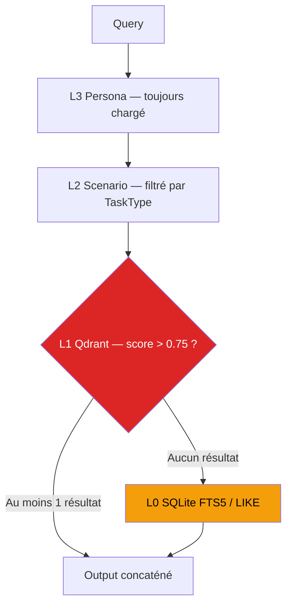
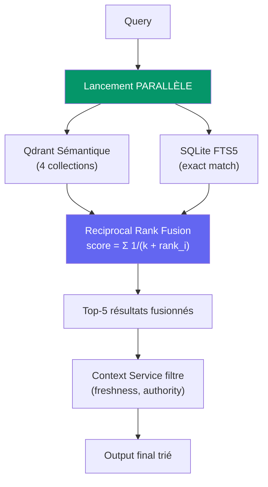
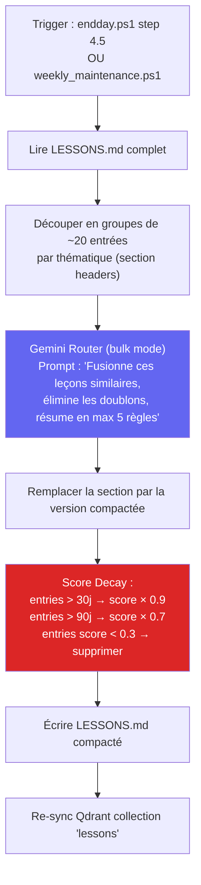
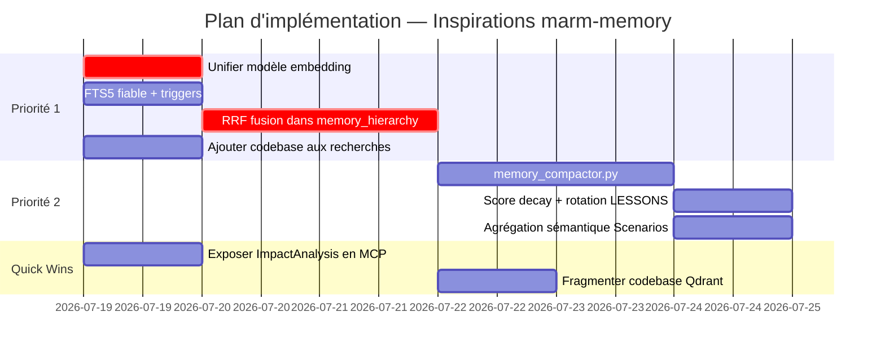

# Analyse Approfondie : Fonctionnalités marm-memory × DEV_CORE

> Analyse basée sur l'inspection complète de 25+ fichiers source de DEV_CORE et de la documentation de [marm-memory](https://github.com/Lyellr88/marm-memory).

---

## Résumé Exécutif

| Recommandation | Verdict Révisé | Effort | Impact |
|---|---|---|---|
| 1. Recherche Hybride + Reranking | 🟢 **FAIRE — Priorité #1** | Moyen (2-3j) | Critique |
| 2. Graphe de Connaissances Code | 🟡 **DÉJÀ PARTIELLEMENT FAIT** — étendre | Faible (1j) | Moyen |
| 3. Compaction LLM de la Mémoire | 🟢 **FAIRE — Priorité #2** | Moyen (2j) | Élevé |
| 4. Carnets Structurés (Notebooks) | 🟠 **REPORTER** — l'existant suffit | N/A | Faible |

---

## 1. Recherche Hybride avec Reranking (RRF)

### Ce que dit marm-memory
`marm_smart_recall` fusionne **FTS (recherche lexicale)** et **recherche sémantique** avec reranking, permettant de retrouver à la fois un ID exact (`T-42`) et un concept flou ("comment on gère l'auth JWT").

### Ce que révèle l'analyse du code DEV_CORE

> [!CAUTION]
> Le pipeline de recherche actuel présente **3 failles structurelles** qui dégradent fortement la qualité du rappel mémoire.

#### Faille 1 : Le FTS5 est un fallback exclusif, pas un complément



Dans [memory_hierarchy.ps1 L126-L160](file:///c:/devcore/DEV_CORE/Scripts/memory_hierarchy.ps1#L126-L160), la recherche SQLite ne se lance **que si `$hasVectorResult` est `$false`**. Conséquence : si Qdrant retourne un résultat sémantique avec score 0.76 sur un sujet tangentiel, la recherche lexicale exacte (qui aurait trouvé le bon résultat via mot-clé) est **court-circuitée**.

#### Faille 2 : Les scores du Context Service sont décoratifs

[context_service.ps1](file:///c:/devcore/DEV_CORE/Scripts/context_service.ps1) calcule des scores composites `(relevance × 0.5) + (freshness × 0.2) + (authority × 0.3)` pour chaque source — mais `memory_hierarchy.ps1` **les ignore totalement**. Toutes les couches sont interrogées inconditionnellement.

#### Faille 3 : Risque de mismatch d'embeddings

[embedding.json](file:///c:/devcore/DEV_CORE/Config/embedding.json) déclare :
- **Stockage** : `text-embedding-3-small` (OpenAI)
- **Requêtes** : `gemini-embedding-001` (Google)

Si les documents sont encodés avec un modèle et les requêtes avec un autre, les scores de similarité cosinus deviennent **aberrants**. Ce mismatch rend le seuil de 0.75 potentiellement trompeur.

#### Autres lacunes identifiées

| Problème | Localisation | Sévérité |
|---|---|---|
| La collection `codebase` n'est **jamais interrogée** | [memory_hierarchy.ps1 L126](file:///c:/devcore/DEV_CORE/Scripts/memory_hierarchy.ps1#L126) — ne cherche que `decisions`, `lessons`, `patterns` | 🟡 |
| Recherche Qdrant **séquentielle** (3 appels curl successifs) | L126-L151 | 🟡 |
| Pas de filtre metadata (date, projet, task_type) sur Qdrant | L128 | 🟡 |
| Table FTS5 potentiellement **inexistante** (try/except silencieux) | [init_conversations_db.py L38-L49](file:///c:/devcore/DEV_CORE/Scripts/init_conversations_db.py#L38-L49) | 🟡 |
| Pas de trigger UPDATE/DELETE sur FTS → données périmées | init_conversations_db.py L42-L45 | 🟡 |

### Proposition d'implémentation révisée



**Fichiers à modifier :**

| Fichier | Modification |
|---|---|
| [memory_hierarchy.ps1](file:///c:/devcore/DEV_CORE/Scripts/memory_hierarchy.ps1) | Lancer FTS5 et Qdrant en parallèle, fusionner via RRF, utiliser les scores du Context Service pour filtrer |
| [init_conversations_db.py](file:///c:/devcore/DEV_CORE/Scripts/init_conversations_db.py) | Garantir la création FTS5 (erreur fatale si absent), ajouter triggers UPDATE/DELETE |
| [embedding.json](file:///c:/devcore/DEV_CORE/Config/embedding.json) | **Unifier le modèle** — utiliser le même pour stockage et requêtes |
| [context_service.ps1](file:///c:/devcore/DEV_CORE/Scripts/context_service.ps1) | Intégrer les scores comme multiplicateurs du score RRF final |

**Algorithme RRF en pseudo-code :**
```python
k = 60  # constante standard RRF
for doc in all_results:
    rrf_score = 0
    if doc in qdrant_results:
        rrf_score += 1.0 / (k + qdrant_rank(doc))
    if doc in fts_results:
        rrf_score += 1.0 / (k + fts_rank(doc))
    # Pondérer par le Context Service
    rrf_score *= context_authority_weight(doc.source)
    final_scores[doc] = rrf_score
return sorted(final_scores, reverse=True)[:5]
```

---

## 2. Graphe de Connaissances Code

### Ce que dit marm-memory
`marm_graph_index`, `marm_code_lookup`, `marm_graph_trace`, `marm_graph_impact` permettent l'indexation AST du code, le traçage des appels, et l'analyse d'impact.

### Ce que révèle l'analyse du code DEV_CORE

> [!IMPORTANT]
> **DEV_CORE possède DÉJÀ un Knowledge Graph.** Mon analyse initiale avait raté ce composant critique.

#### Existant : `knowledge_graph.ps1` (470 lignes)

Le fichier [knowledge_graph.ps1](file:///c:/devcore/DEV_CORE/Scripts/knowledge_graph.ps1) construit un graphe complet stocké dans `DEV_CORE_DATA\Knowledge\graph.json` (**2.3 MB**) :

| Composant | Détails |
|---|---|
| **Types de nœuds** | `project`, `task`, `commit`, `file`, `service`, `event`, `metric`, `decision` |
| **Types d'arêtes** | `project_task`, `task_commit`, `commit_file`, `file_service`, `event_task`, `metric_task`, `decision_service` |
| **Impact Analysis** | BFS à 3 niveaux de profondeur (`New-ImpactAnalysis`) avec calcul de `blast_radius` |
| **Actions supportées** | `Build`, `ImpactAnalysis`, `Status`, `Health` |

#### Existant : `repowise` MCP Server

Le fichier [.mcp.json](file:///c:/devcore/.mcp.json) configure un serveur MCP externe `repowise` décrit comme *"codebase intelligence — docs, graph, git signals, dead code, decisions"*.

#### Ce qui manque vs marm-memory

Le graphe existant est **structurel** (tâches → commits → fichiers) mais **pas sémantique** (pas de parsing AST, pas de relations fonction→fonction). Les lacunes :

| Capacité marm-memory | Existant DEV_CORE | Écart |
|---|---|---|
| Indexation AST (fonctions, classes) | ❌ Non — le codebase est indexé comme **un seul blob vectoriel** dans Qdrant | 🔴 Important |
| Symbol/Call tracing | ❌ Non — pas de suivi des imports/appels | 🟡 Moyen |
| Impact analysis par fichier | ✅ Oui — `knowledge_graph.ps1 -Action ImpactAnalysis` | ✅ Couvert |
| Architecture understanding | ✅ Partiel — via `CODEBASE_INDEX.md` + `repowise` | 🟢 Acceptable |

### Verdict révisé

**Ne pas reconstruire de zéro.** Étendre l'existant :

1. **Court terme** : Ajouter la collection `codebase` aux recherches dans [memory_hierarchy.ps1 L126](file:///c:/devcore/DEV_CORE/Scripts/memory_hierarchy.ps1#L126) (ajouter `"codebase"` à la liste `@("decisions", "lessons", "patterns")`)
2. **Court terme** : Exposer `knowledge_graph.ps1 -Action ImpactAnalysis` comme outil MCP dans [devcore-scripts/server.py](file:///c:/devcore/DEV_CORE/MCP/devcore-scripts/server.py)
3. **Moyen terme** : Fragmenter l'index codebase en vecteurs par fichier/fonction au lieu d'un blob unique dans [qdrant_sync.ps1](file:///c:/devcore/DEV_CORE/Scripts/qdrant_sync.ps1) (section codebase, autour de la ligne 222)

---

## 3. Compaction de Mémoire assistée par LLM

### Ce que dit marm-memory
`marm_compaction` utilise un LLM pour résumer les sessions longues, fusionner les doublons, et maintenir la mémoire propre et exploitable.

### Ce que révèle l'analyse du code DEV_CORE

> [!WARNING]
> **LESSONS.md est une bombe à retardement.** 480 lignes / 33 KB et en croissance illimitée, sans aucune rotation ni compaction.

#### État des lieux : Aucun LLM n'est utilisé pour la mémoire

La recherche exhaustive dans le codebase confirme : **zéro appel LLM** pour la gestion mémoire. Tous les processus sont mécaniques :

| Processus | Méthode actuelle | Problème |
|---|---|---|
| Extraction de leçons | Regex sur git log + task titles | Entrées brutes, jamais résumées |
| Agrégation L1→L2 | `grep` par mot-clé de TaskType ("auth", "api", "ui") | Passe à côté de leçons pertinentes qui ne contiennent pas le mot-clé exact |
| Rotation MEMORY.md | Troncature mécanique à 200 lignes si > 300 | LESSONS.md n'a **aucune rotation** |
| Dédup Qdrant | Documentée "SHA-256 obligatoire" dans MEMORY.md, mais **non implémentée dans le code** | Doublons possibles dans les collections |
| Scores d'entrées | Assignés une fois (`[score: 0.5-0.95]`) | **Jamais décroissants**, jamais réévalués |

#### Anatomie du problème LESSONS.md

```
Taille actuelle : 33,190 bytes / 480 lignes
Croissance : ~7 entrées/jour (tâches complétées + git stats)
Projection 6 mois : ~1,260 lignes supplémentaires → ~100 KB
Doublons identifiés :
  - Git stats avec fenêtres de 7 jours qui se chevauchent
  - Leçons de tâches "1 steps" quasi-identiques
  - Sections thématiques non mises à jour (architecture, debugging)
```

Les fichiers Scenario (`Scenarios/api.md`, `Scenarios/auth.md`, etc.) sont générés par un simple grep de mots-clés dans `memory_hierarchy.ps1 -Action Aggregate` — ce qui signifie qu'une leçon sur "l'authentification JWT dans l'API" ne sera copiée **que** dans le scénario `auth` si elle contient le mot "auth", et passera à côté du scénario `api`.

#### Proposition d'implémentation

Créer un nouveau script `memory_compactor.py` (Python, pour utiliser le Gemini Router) :



**Fichiers à modifier/créer :**

| Fichier | Action |
|---|---|
| `Scripts/Auto/memory_compactor.py` | **[CRÉER]** Script Python de compaction LLM |
| [endday.ps1](file:///c:/devcore/DEV_CORE/Scripts/endday.ps1) | Ajouter un step 4.5 appelant `memory_compactor.py` |
| [memory_hierarchy.ps1](file:///c:/devcore/DEV_CORE/Scripts/memory_hierarchy.ps1) | Dans `Aggregate`, remplacer le grep par un appel LLM pour classification sémantique des leçons dans les bons Scenarios |
| [lesson_extractor.ps1](file:///c:/devcore/DEV_CORE/Scripts/Auto/lesson_extractor.ps1) | Ajouter un champ `created_at` ISO à chaque entrée pour permettre le score decay |
| [memory_service.ps1](file:///c:/devcore/DEV_CORE/Scripts/memory_service.ps1) | Ajouter `RotateLessons` (rotation à 300 lignes, comme MEMORY.md) |

**Prompt de compaction suggéré :**
```
Tu es un assistant qui consolide des leçons de développement.
Entrées : une liste de leçons avec [score: X.X] et [lesson:TAG].
Règles :
1. Fusionne les leçons qui disent la même chose en une seule règle claire
2. Supprime les entrées devenues obsolètes ou contredites par une entrée plus récente
3. Conserve les TAGs les plus récents
4. Conserve le score le plus élevé du groupe fusionné
5. Résultat : max 5 leçons par section, format identique à l'entrée
```

---

## 4. Carnets de Connaissances Structurés (Notebooks)

### Ce que dit marm-memory
`marm_notebook` offre un stockage persistant de connaissances de référence par domaine.

### Ce que révèle l'analyse du code DEV_CORE

> [!NOTE]
> DEV_CORE possède déjà **5 systèmes de stockage structuré** qui couvrent largement le besoin "notebook" de marm-memory.

| Système existant | Équivalent notebook | État |
|---|---|---|
| **Obsidian Vault** (41 daily notes, structure à 12 dossiers) | Notes de projet, décisions, architecture | ✅ Actif, bien structuré |
| **Knowledge Graph** (`graph.json` — 2.3 MB) | Graphe de connaissances projet | ✅ Actif |
| **Memory Layer L2** (Scenarios par domaine) | Fiches de référence par task type | ✅ Actif (4 fichiers) |
| **Skills Registry** (11 skills avec triggers) | Catalogue de compétences | ✅ Actif |
| **5 registres structurés** (AI capabilities, intent patterns, model pricing, routing profiles, guided recovery) | Configuration de référence | ✅ Actif |

Le Vault Obsidian a des **répertoires vides** (`Decisions/`, `References/`, `Architecture/`, `Lessons/architecture/`, `Lessons/bug/`) qui pourraient servir de "notebooks" sans aucun développement supplémentaire.

### Verdict révisé

**Reporter.** L'infrastructure existante couvre le besoin. Le seul manque est que l'agent n'a pas de **raccourci MCP unique** pour créer/lire une fiche de référence structurée — mais le serveur MCP `obsidian-vault` avec ses outils `obsidian_create_note` et `obsidian_read_note` remplit déjà ce rôle.

**Action légère si nécessaire** : Ajouter un outil MCP `devcore_reference_note` dans [devcore-scripts/server.py](file:///c:/devcore/DEV_CORE/MCP/devcore-scripts/server.py) qui wrappe `obsidian_create_note` avec un template de fiche de référence pré-rempli (frontmatter standardisé, sections obligatoires).

---

## Plan d'Action Recommandé



### Métriques de succès

| Métrique | Baseline actuelle | Cible |
|---|---|---|
| Résultats pertinents dans le top-3 | Non mesuré (concaténation brute) | > 80% de précision via RRF |
| Taille LESSONS.md | 480 lignes / 33 KB | < 150 lignes après compaction initiale |
| Temps de recherche mémoire | ~3-5s (3 appels curl séquentiels) | < 1.5s (parallélisation) |
| Couverture des collections | 3/4 (codebase exclu) | 4/4 |
| Doublons dans Qdrant | Non vérifié (SHA-256 non implémenté) | 0 (hash enforced) |
